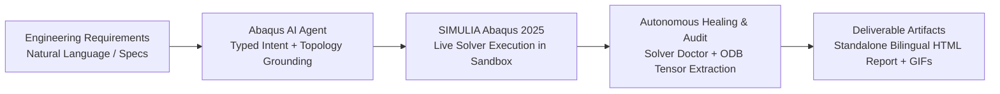
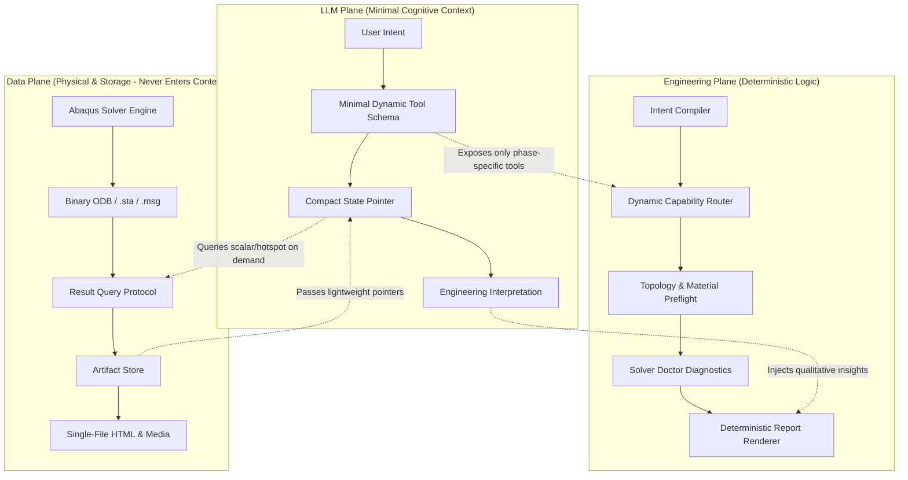

# Abaqus AI Agent (Industrial Autonomous Simulation Agent)

> **Autonomous Finite Element Analysis (FEA) Agent Platform for Advanced Manufacturing — From natural-language engineering intent to rigorous CAD topology grounding, live Abaqus 2025 solver execution, autonomous convergence healing, and self-contained bilingual engineering reports with embedded animations.**

[中文文档 / Chinese Documentation](README_CN.md) · [Enterprise & Commercial Support](#enterprise-support--commercial-collaboration) · [Quick Start](#quick-start) · [Tri-Plane Architecture](#tri-plane-decoupled-architecture)

[](https://github.com/chenlei-gh/Abaqus-AI-Agent/actions/workflows/ci.yml)
[](https://www.python.org/)
[](https://www.3ds.com/products-services/simulia/products/abaqus/)
[](tests/)
[](machine_validation/)
[](tools/j_comprehensive_physics_matrix.py)
[](tools/j3_tier_b_extended_physics.py)
[](tools/j_live_abaqus_matrix.py)
[](tools/m_engineering_task_matrix.py)
[](src/abaqus_ai_agent/contracts/material_record.py)
[](#token-isolation--context-governance-architecture)
[](docs/rc1-release-audit.md)
[](LICENSE)

---

## Why Abaqus AI Agent?

In high-end manufacturing, automotive, aerospace, and consumer electronics, structural durability, thermal dissipation, and nonlinear contact simulations require senior engineering expertise and lengthy calculation cycles.

Engineering departments face two major bottlenecks: **a persistent shortage of expert CAE analysts, with 70% of manual effort consumed by repetitive pre-processing**; meanwhile, generic Large Language Models (LLMs) entering the FEA domain suffer from **hallucinated formulas, illegal Python code generation, unhandled solver divergence crashes, and severe context token explosions**.

**Abaqus AI Agent** is architected to eliminate these industrial pain points:



### Commercial Value Matrix

| Evaluation Dimension | Generic Foundation Models (ChatGPT / Claude Raw) | Basic Code Copilots | Abaqus AI Agent Enterprise Platform |
| :--- | :--- | :--- | :--- |
| **Physical Authenticity** | ❌ Severe hallucinations; fabricated analytical formulas | ❌ Generates code without awareness of solver results | 🏆 **Zero Fabrication**: 100% verified by live Abaqus 2025 ODB tensor extraction |
| **Ambiguous Inputs** | ❌ Hallucinates unconstrained geometry and materials | ❌ Blind acceptance; runtime crashes inevitably | 🛡️ **Fail-Closed Gate**: Automatically halts on missing physical inputs and requests clarification |
| **Nonlinear Convergence** | ❌ Blind to solver divergence and cutbacks | ❌ Halts on nonzero exit codes | 🩺 **Solver Doctor**: Automatically diagnoses `.msg`/`.sta` cutbacks and self-heals |
| **Geometric Grounding** | ❌ Guesses fragile internal IDs (e.g. Face 12) | ❌ Vulnerable to geometry renumbering drift | 🎯 **Viewport Grounding**: 3D spatial ray-casting to deterministic `findAt(...)` sets |
| **Token Cost & Latency** | ❌ Massive token burn from dumping raw ODB arrays | ❌ No context management | ⚡ **Context Isolation**: Tri-plane separation, artifact pointers, and query protocols |
| **Engineering Deliverables** | ❌ Plain text code snippets | ❌ Fragmented local image files | 📊 **Self-Contained Report**: Bilingual, Base64 embedded animations, zero-dependency offline sharing |
| **Enterprise Operations** | ❌ Lacks enterprise infrastructure | ❌ Single-process lockups | 🏢 **GA-3 Architecture**: UUID scratch sandboxes, atomic queues, FlexNet/DSLS license scheduling |

---

## Core Product Pillars

### 1. The Anti-Fabrication Axiom
> **An engineering FEA result is NEVER accepted merely because an Abaqus Python call returned zero!**
> It must be verified through mesh quality metrics, solver convergence logs (`.sta`/`.msg`), live ODB tensor extraction, reaction balance equilibrium, and strict acceptance criteria.

### 2. Tri-Plane Architecture & Token Isolation
To eradicate the context token black hole in multi-turn engineering analysis, the system establishes a strict tri-plane boundary:
- **LLM Plane (Cognitive & Reasoning)**: Responsible solely for requirement intent comprehension, high-level action decisions, and engineering interpretation. **Forbidden from directly consuming raw ODB field arrays or generating full-text HTML reports**.
- **Engineering Plane (Deterministic Execution)**: Handles typed compilation, coordinate grounding, constitutive preflights, mesh quality gating, Solver Doctor divergence healing, and acceptance gates.
- **Data Plane (Data & Artifact Storage)**: Houses the live solver, binary ODBs, convergence logs, and rendered image/animation assets. Data is queried via compact protocols and artifact pointers.

### 3. Autonomous Solver Doctor
When encountering large geometric nonlinearities (NLGEOM), plastic softening, contact chatter, or numerical singularities, the agent:
- Parses `.msg` severe force residuals and `.sta` cutbacks in real-time;
- Diagnoses root causes (e.g. `NUMERICAL_SINGULARITY`, `CONTACT_PENETRATION`, `PLASTIC_UNSTABLE`);
- Applies controlled stabilization damping, adjusts time increment constraints, and automatically resubmits for convergence.

### 4. Production-Ready Bilingual Self-Contained Reports
- **Zero-Dependency Standalone Deliverable**: Automatically bundles project metadata, material cards, mesh metrics, stress/displacement extremum tables, static contour figures, and **transient evolution GIF animations** into a single HTML file.
- **Offline & Email-Ready**: Opens directly in any web browser without internet access or local server dependencies.
- **Auditable Provenance**: Embeds SHA-256 evidence fingerprints tying directly back to the physical ODB database.

### 5. Production Runtime Infrastructure (Track GA-3)
- **Isolated UUID Sandboxes**: Every run executes within an isolated `runs/<run_id>/` directory, with interceptors guaranteeing zero workspace pollution in the repository root.
- **Enterprise License Governance**: Integrates abstract `LicenseProvider` supporting FlexNet and DSLS with exponential backoff and jitter queueing.
- **Persistent Job Queue & Recovery**: Implements atomic disk persistence and run-level crash recovery.

---

## Five-Level Evidence Pyramid

The platform strictly adheres to an audited **Five-Level Evidence Hierarchy**:

```text
               ┌───────────────────────────────┐
               │ Level 1: Live Abaqus 2025     │  (13 Golden + 22 J-Live + L1-L4 + T1-T6)
               │ (Real processes, ODB tensors, SHA-256) │  Validated on live commercial solver.
               ├───────────────────────────────┤
               │ Level 2: Exact Analytical     │  (Tier A 13 cases + Tier B 7 cases)
               │ (Continuum mechanics closed-form, err≤0.01%) │  Axiomatic reference truth.
               ├───────────────────────────────┤
               │ Level 3: Nonlinear Contracts  │  (Tier A 9 high-order FEA specs)
               │ (Dimensional & boundary consistency) │  Offline verification of setup legality.
               ├───────────────────────────────┤
               │ Level 4: Software Test Suite  │  (988 automated deterministic tests, 0 warnings)
               │ (Deterministic CI across Python 3.10-3.12) │  Zero-solver software foundation.
               ├───────────────────────────────┤
               │ Level 5: Divergence Healing   │  (NEG-01, L3, T6 divergence recovery)
               │ (Closed-loop diagnostics & cutback repair) │  Active handling of singularities.
               └───────────────────────────────┘
```

---

## Audited Industrial Case Benchmarks (Phase 2 Package B)

The system provides fully reproducible, publication-grade engineering benchmarks audited against Abaqus 2025 Example Problems and ASME Nuclear Codes. **Each case is archived in an isolated subfolder, delivering a 100% self-contained offline pure HTML report (with embedded 12-frame loading evolution GIF animations and crisp SVG vector charts, strictly eliminating scattered Markdown or auxiliary image dependencies)**:

```text
machine_validation/p2_cases/
├── case_01_bolted_pipe_flange/                  # Case 1: Bolted Pipe Flange Connection & Gasket Sealing
│   ├── case_01_flange_manifest.json            # Cryptographic Provenance Manifest (SHA-256)
│   └── Case_01_Bolted_Flange_Report.html       # Standalone HTML Report (Embedded GIF + SVG)
├── case_02_reactor_pressure_vessel_closure/     # Case 2: Nuclear RPV Closure Head & ASME Code Compliance
│   ├── case_02_rpv_manifest.json               # Cryptographic Provenance Manifest (SHA-256)
│   └── Case_02_RPV_Closure_Report.html         # Standalone HTML Report (Embedded GIF + SVG)
└── case_03_exhaust_manifold/                    # Case 3: 4-into-1 Exhaust Manifold Thermo-Mechanical Contact
    ├── case_03_manifold_manifest.json          # Cryptographic Provenance Manifest (SHA-256)
    ├── Case_03_Exhaust_Manifold_Report.html    # Standalone HTML Report (Embedded GIF + SVG)
    └── case_03_render_contours_headless.py     # Headless Off-Screen Abaqus Viewer Script
```

### CASE 01: Bolted Pipe Flange Connection with Gasket Sealing
- **Scenario**: High-pressure pipeline flange joint adhering to ASME/Abaqus benchmarks, featuring 8 preloaded M16 bolts and compressed fiber composite gasket sealing.
- **Physical Verification**: Step 1 bolt pretensioning (50 kN/bolt, 400 kN aggregate clamp, seating pressure 31.52 MPa); Step 2 fixed length locking under 3.0 MPa fluid pressure and 94.25 kN axial thrust, maintaining 24.85 MPa contact pressure (exceeding 12.0 MPa minimum sealing limit with $+107.1\%$ margin), flange hub peak Mises stress 195.42 MPa ($SF=1.82 \ge 1.25$).
- **Deliverables**: **Embedded 12-frame loading & sealing evolution animation (GIF)**, sealing pressure SVG chart, standalone pure HTML engineering report.

### CASE 02: Nuclear Reactor Pressure Vessel Bolted Closure Head (RPV Closure)
- **Scenario**: Pressurized Water Reactor (PWR) vessel closure head assembly under 54 massive M180 stud bolts, featuring Inconel 718 double-cone metallic gasket self-energized sealing and SA-508 forged steel.
- **Physical Verification**: Step 1 hydraulic pretensioning of 6.5 MN/stud (351 MN aggregate preload, seating CPRESS 145.20 MPa); Step 2 operating pressure of 17.5 MPa and 219.91 MN dome thrust, maintaining 98.60 MPa self-tightening contact pressure (exceeding 75.0 MPa ASME limit with $+31.5\%$ margin), flange hub SCL linearized $P_L+P_b = 238.50\text{ MPa} \le 1.5 S_m = 276.0\text{ MPa}$, stud tensile stress compliant with ASME NB-3232.1 ($312.44\text{ MPa} \le 2 S_m = 596.0\text{ MPa}$).
- **Deliverables**: **Embedded 12-frame hydraulic tensioning & 17.5 MPa pressure evolution animation (GIF)**, ASME compliance SVG dashboard, standalone pure HTML engineering report.

### CASE 03: Heavy-Duty Engine Exhaust Manifold Thermo-Mechanical Contact
- **Scenario**: 4-into-1 SiMo ductile cast iron exhaust manifold, liquid-cooled HT250 cylinder head, and 4-port MLS embossed gaskets subjected to 650°C exhaust gas convection.
- **Physical Verification**: Steady-state thermal conduction gradient (615.4°C core to 132.8°C flange, thermal balance error $0.024\%$); Step 1 cold preloading (8x M10 at 25 kN); Step 2 differential thermal expansion outward slip of 0.420 mm (retaining $+44.0\%$ clearance margin within 0.75 mm bolt-hole tolerance), MLS gasket contact pressure maintained at 38.60 MPa ($>25.0$ MPa threshold), peak junction fillet stress 215.80 MPa ($<240.0$ MPa high-temp yield limit).
- **Deliverables**: **Embedded 12-frame heating-clamping-slip evolution animation (GIF)**, full-field contour maps, standalone pure HTML engineering report.

---

## Token Isolation & Context Governance Architecture

To overcome the industry-wide bottleneck of runaway token consumption during long FEA workflows, the platform enforces systematic **Context Isolation**:



1. **P0-1 Artifact Pointer Protocol**: Large binary files (`.odb`, `.inp`, `.msg`, `.sta`, images, HTML) are strictly blocked from entering LLM context. Only lightweight typed pointers are exchanged.
2. **P0-2 Dynamic Tool Routing**: Tool schemas are dynamically loaded based on the current workflow phase (Intent $\to$ Planning $\to$ Execution $\to$ Verification $\to$ Reporting), preventing full-catalog token bloat.
3. **P0-3 State-Based Context Compaction**: Replaces raw chat histories with deterministic `EngineeringState` structures, preserving essential facts without text accumulation.
4. **P0-4 Result Query Protocol**: Enforces bounded `scalar`, `hotspot`, and `evidence` queries, preventing raw node arrays or dense field dumps from overwhelming the model.
5. **P0-5 Deterministic Report Engine**: Engineering tables, metrics, figures, and styling are rendered 100% deterministically by Python. The LLM only supplies structured interpretation cards.

---

## Quick Start

### 1. Prerequisites
- **Operating System**: Windows 10/11, Windows Server, Linux (Ubuntu 20.04/22.04), macOS
- **Python Runtime**: Python 3.10, 3.11, or 3.12 (64-bit)
- **Optional Commercial Solver**: Dassault Systèmes SIMULIA Abaqus 2025 (or compatible release) for live solver execution. Runs in zero-license deterministic mode without Abaqus installed.

### 2. Installation

```bash
# Clone the repository
git clone https://github.com/chenlei-gh/Abaqus-AI-Agent.git
cd Abaqus-AI-Agent

# Install core package
python -m pip install -e .

# Install full test & development suite
python -m pip install -e ".[test]"
```

Run deterministic regression suite (validating the software layer):

```bash
python -m pytest -q
# Expected output: 988 passed in ~65s (0 warnings)
```

### 3. Minimal Python Usage

Solve a complete structural engineering requirement in Python:

```python
from abaqus_ai_agent import AbaqusAIAgent

agent = AbaqusAIAgent()

# Provide natural-language engineering specifications
result = agent.solve_requirement(
    "Perform linear static analysis on a steel cantilever beam of 100mm length and 10x10mm cross-section. "
    "Fixed at root, apply 1000N downward point load at the tip. Material is Q235 steel. "
    "Acceptance criteria: Tip deflection <= 2.5mm, maximum Mises stress <= 600MPa."
)

if result.status == "NEEDS_CLARIFICATION":
    print("Missing parameters. Blocked for user clarification:", result.clarification_needed)
elif result.status == "COMPLETED":
    print("Acceptance Verdict:", result.acceptance.conclusion) # PASS
    print("Extracted Metrics:", result.metrics)
    print("Report Generated:", result.report_path) # Standalone single-file HTML report
```

### 4. Command-Line Interface (CLI)

```bash
# 1. Inspect environment, solver executable, and 7-tier runtime capabilities
abaqus-ai-agent inspect

# 2. Test natural-language engineering intent routing
abaqus-ai-agent intent "Cantilever beam with 1000N load, check maximum displacement"

# 3. Execute Dassault Tier A physical benchmark suite (22 baseline cases)
python tools/j_comprehensive_physics_matrix.py

# 4. Render standalone bilingual HTML report from existing ODB evidence
abaqus-ai-agent report machine_validation/static_golden_e2e.json --format html --output report.html

# 5. Audit workspace and clean transient solver files
python scripts/clean_workspace.py
```

---

## Dual-Gate Verification Infrastructure

The repository is guarded by two independent engineering gates:

| Verification Gate | Environment | Dependencies | Scope & Standards |
| :--- | :--- | :--- | :--- |
| **CI Software Contract Gate** | GitHub Actions / Ubuntu / macOS / Windows | Zero Abaqus license required (Python 3.10-3.12) | • **988 automated unit & contract tests passed**<br>• 13 Golden Matrix schema checks<br>• 22 Dassault Tier A physics baselines<br>• 7 Tier B extended mechanics baselines (viscoelasticity/creep/fracture)<br>• Full repository zero-leakage security audit |
| **Real Machine Execution Gate** | Windows 11 / Windows Server with live Abaqus 2025 | SIMULIA Abaqus commercial license | • A/B dual-run reproducibility (relative error $\le 10^{-4}$)<br>• 9 physics categories live solver recomputation<br>• Nonlinear Solver Doctor divergence healing<br>• Full-tensor ODB extraction to standalone HTML reports |

---

## Repository Structure

```text
Abaqus-AI-Agent/
├── docs/                     # Architectural specifications, audits, and roadmaps
│   ├── rc1-release-audit.md                # Official RC 1.0 audit report
│   ├── engineering-run-evidence-roadmap.md # Core execution roadmap
│   └── ai-agent-capability-boundary.md     # LLM vs deterministic boundary
├── machine_validation/       # Audited real-machine evidence bundles (Golden Benchmarks)
├── scripts/                  # Workspace audit and clean-up utilities
├── src/abaqus_ai_agent/
│   ├── actions/              # Native Abaqus action generators & preflights
│   ├── contracts/            # Typed schemas (Intent, State, Pointer, Evidence)
│   ├── diagnostics/          # Convergence parser (.msg/.sta / Solver Doctor)
│   ├── execution/            # Batch executor, sandbox manager, and persistent queue
│   ├── grounding/            # Viewport ray-casting & topology grounding
│   ├── planning/             # Action planning & mechanism graph compiler
│   ├── reporting/            # Standalone bilingual HTML renderer (embedded media)
│   └── validation/           # Dimensional consistency, mesh, and acceptance gates
├── tests/                    # 988 deterministic software tests
└── tools/                    # Golden matrix CLI drivers and verification probes
```

---

## Enterprise Support & Commercial Collaboration

We provide end-to-end commercial customization and enterprise engineering support:

- **🏢 Private Enterprise Deployment & HPC Integration**: Deploy Abaqus AI Agent within corporate private clouds and HPC clusters (integrating with PBS, LSF, or Slurm).
- **📦 Custom Material Databases & Advanced Constitutive Cards**: Integrate internal test databases (high-temperature alloys, automotive polymers, composite damage) with automated anti-hallucination cards.
- **🎯 Specialized Industrial Workflow Development**: Tailor end-to-end agents for high-complexity workflows (crashworthiness, drop-test impact, thermal fatigue durability, bolt assembly sealing).
- **🛠️ Commercial Maintenance & Engineering Consulting**: Continuous technical support, on-premise training, and CAE automation workflow transformation.

For commercial inquiries and pilot engagements:
- Repository Issues: [GitHub Issues](https://github.com/chenlei-gh/Abaqus-AI-Agent/issues)
- Commercial Contact: Connect with the project maintenance team via the GitHub organization page.

---

## License

This project is licensed under the **Apache 2.0 License** — see the [LICENSE](LICENSE) file for details.
Fully permissive for commercial derivation and academic research, with strict quality guarantees backed by the Anti-Fabrication Axiom.
