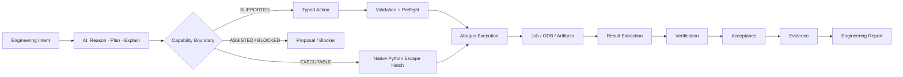
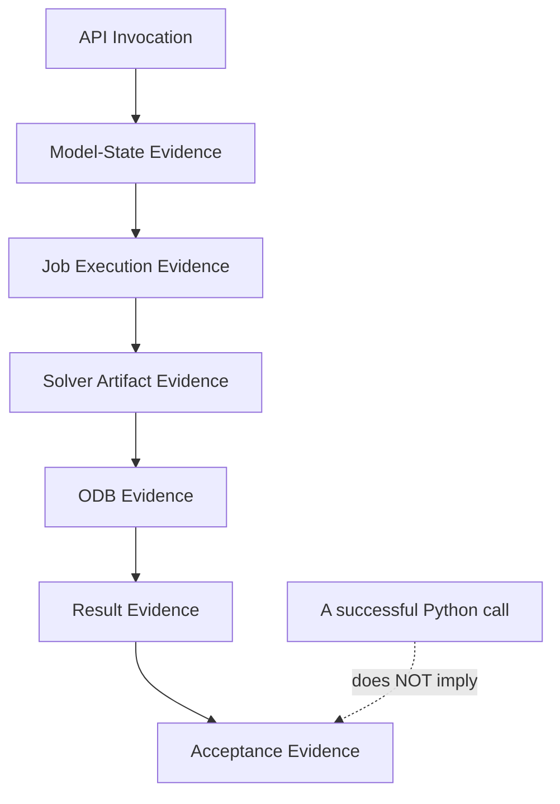
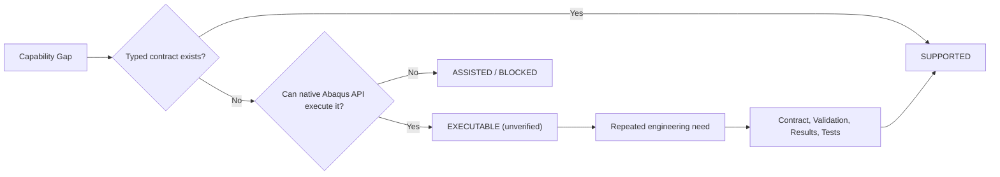

# Abaqus AI Agent

> **Open-source AI engineering agent for Abaqus/CAE — from engineering intent to validated native Abaqus actions, solver evidence, and acceptance.**

[中文文档 / Chinese](README_CN.md)

[](https://github.com/chenlei-gh/Abaqus-AI-Agent/actions/workflows/ci.yml)
[](https://www.python.org/)
[](https://www.3ds.com/products-services/simulia/products/abaqus/)
[](tests/)
[](machine_validation/)
[](tools/j_comprehensive_physics_matrix.py)
[](src/abaqus_ai_agent/contracts/material_record.py)
[](#)
[](LICENSE)

> **Project status: Release Candidate Baseline Frozen (`v1.0.0-rc1`).**
> The foundational engineering contracts, deterministic software gates (387 passed tests), full-chain **Abaqus 2025 real-machine execution gates (13/13 Golden Ladder)**, and the **22 Tier A Official Dassault Benchmarks Matrix** are complete and closed. All live solver verifications are grounded in verifiable, audited machine artifacts.

### Quick navigation

- [Overview](#overview)
- [Core Product Pillars](#core-product-pillars)
- [At a glance](#at-a-glance)
- [Architecture & Engineering Closure](#architecture--engineering-closure)
- [Current capability status](#current-capability-status)
- [Abaqus 2025 machine validation](#abaqus-2025-machine-validation)
- [Installation & Setup](#installation--setup)
- [Command-Line Interface (CLI)](#command-line-interface-cli)
- [Minimal usage](#minimal-usage)
- [Testing & Dual-Gate Verification](#testing--dual-gate-verification)
- [Safety and failure boundaries](#safety-and-failure-boundaries)
- [Repository structure](#repository-structure)
- [Documentation Index](#documentation-index)

---

## Overview

**Abaqus AI Agent** is an autonomous finite-element engineering agent designed to operate with native Abaqus/CAE models, solvers, and simulation lifecycles.

It bridges the divide between high-level engineering requirements and rigorous finite-element physics:

**Engineering Requirements → Typed Intent (JEV) → Solver Selection → Topology Grounding → Validated Actions → Abaqus Execution → ODB Extraction → Verification & Acceptance → Evidence Bundle → Engineering Report**

The project enforces an uncompromising design boundary: **The AI layer is strictly decoupled from the solver kernel.** It does not attempt to replace Abaqus, fabricate pseudo-finite-element solutions, or turn vague natural-language prompts into hallucinated geometry.

### The Anti-Fabrication Axiom

> **An engineering result is NEVER accepted merely because an Abaqus Python call returned zero. It must be proven through model state, job monitor artifacts (.sta/.msg/.log), ODB tensor extraction, and strict numerical acceptance criteria.**

```text
"Python script returned 0"
        ≠
"Abaqus model geometry & mesh are valid"
        ≠
"Solver converged without numerical divergence"
        ≠
"Requested field outputs exist in ODB"
        ≠
"Engineering acceptance criteria are satisfied"
```

---

## Core Product Pillars

### 1. TypeSafe JEV Intent Engine with Fail-Closed Ambiguity Gate
Natural language inputs are compiled into strongly-typed `EngineeringIntent` records via a hybrid architecture (TypeSafe JEV online judgments or deterministic offline routing).
- **Strict Fail-Closed Rule**: If a prompt lacks essential physical prerequisites (e.g. dimensions, material parameters, boundary conditions, or acceptance thresholds), the agent **refuses to guess**. It immediately flags `NEEDS_CLARIFICATION` and halts in a `BLOCKED` state until the engineer provides explicit inputs.

### 2. Live Abaqus A/B Dual-Run & Zero Analytical Stubs
To guarantee physical reproducibility across independent solver executions:
- **A/B Dual-Run Protocol**: Executes two independent Abaqus 2025 processes (`Run A` vs `Run B`), extracting field/history metrics directly from output databases. Results must match within a strict relative numerical tolerance (tolerance ≤ 1e-4).
- **Perturbation Sensitivity**: A controlled 10% material parameter perturbation (e.g. Young's modulus E × 0.9) is verified to cause an intentional acceptance gate rejection.
- **Zero Analytical Stubs**: The case evaluation pipeline strictly forbids hardcoded textbook formulas (such as FL³/3EI) to masquerade as fresh runs.

### 3. Viewport & Image Topology Grounding
Solves the fundamental problem of connecting visual intention to finite-element geometry without fragile entity IDs:
- Maps 2D camera/viewport coordinates or technical drawing annotation points into 3D ray-cast spatial candidate points.
- Automatically derives deterministic `findAt(...)` topological expressions in native Abaqus/CAE.
- Materializes verified native `Sets` and `Surfaces` for boundary conditions, loads, and contact pairs.

### 4. Material Intelligence & Multi-Point Database Integration
Solves the critical gap between commercial datasheets (e.g. CAMPUS, ISO 10350 / ISO 11403) and Abaqus constitutive models:
- **MaterialRecord Canonical Schema**: Encapsulates material identity (polymer family, grade, manufacturer), test conditions (temperature, moisture, ISO specimen standard), and multi-point curves (tensile stress-strain, creep, DMA).
- **Anti-Hallucination Constitutive Preflight**: Automatically validates thermodynamic and mathematical compatibility. Prevents engineering plastics from being erroneously assigned metallic $J_2$ plasticity without proper calibration. Flags `BLOCKED` on missing test conditions.
- **Apache-2.0 Clean-Room Architecture**: Avoids shipping proprietary materials databases in the git repository while offering clean runtime adapters (`CampusAdapter`, `ManufacturerAdapter`).

### 5. Autonomous Engineering Report Generation
Generates complete, publication-grade engineering reports directly from live `AnalysisRun` evidence:
- Produces self-contained **Markdown** and standalone styled **HTML** documents.
- Automatically compiles Executive Summaries, Model Configurations, Material Properties, Results Tables, Acceptance Verdicts, and ODB Provenance Hashes.

---

## At a glance

### End-to-End Workflow



### The Engineering Evidence Ladder



### Capability Lifecycle



---

## Architecture & Engineering Closure

The canonical entity throughout the entire execution lifecycle is the `AnalysisRun`. No parallel data capsules or disconnected schemas are created.

```text
User / Engineering Requirements
            │
            ▼
     EngineeringIntent  ───[ Ambiguity Gate: Fail-Closed if incomplete ]
            │
            ▼
     AnalysisWorkflow
            │
            ├─────────────────────────────────────────┐
            ▼                                         ▼
      Action Planning                          Preflight Checks
   (Typed Native Actions)                  (UnitSystem & Topology)
            │                                         │
            └────────────────────┬────────────────────┘
                                 ▼
                         Abaqus Execution
                     (Bridge / Batch / noGUI)
                                 │
                                 ▼
                     Job Artifacts & ODB Output
                     (.sta / .msg / .dat / .odb)
                                 │
                                 ▼
                      Result Tensor Extraction
                                 │
                                 ▼
                        Numerical Verification
               (GCI / Reaction Balance / Energy Ratios)
                                 │
                                 ▼
                        Engineering Acceptance
                       (Strict Gate: PASS/FAIL)
                                 │
                                 ▼
                          Evidence Bundle
                                 │
                                 ▼
                     Engineering Analysis Report
                         (Markdown & HTML)
```

---

## Current capability status

The capability surface is strictly classified into formalized, verified capabilities versus transparent escape hatches:

| Functional Area | Current Baseline Status | Verification Boundary |
|:---|:---|:---|
| **Core Action Contracts** | ✅ SUPPORTED | Schema, unit consistency, parameter validation |
| **Material Definitions** | ✅ LIVE VALIDATED | Elasticity, Plasticity, Density, Conductivity, Specific Heat, Expansion |
| **Static Stress Analysis** | ✅ LIVE VALIDATED | Tip-loaded 3D cantilever, reaction balance, Mises sanity |
| **Explicit Dynamics** | ✅ LIVE VALIDATED | CFL time-step limit, energy conservation, hourglass control |
| **Implicit Dynamics** | ✅ LIVE VALIDATED | Dynamic amplification (DAF), transient vibration, ALLKE/ALLIE ratio |
| **Steady Heat Transfer** | ✅ LIVE VALIDATED | 1D conduction bar, analytical temperature field, heat flux conservation |
| **Coupled Temp-Displacement** | ✅ LIVE VALIDATED | Simultaneous mechanical and thermal step execution |
| **Material Intelligence** | ✅ LIVE VALIDATED | ISO 10350 single-point, ISO 11403 curves, CAMPUS & TDS adapters |
| **Official Benchmark Suite** | ✅ LIVE VALIDATED | 22 Dassault Verification Guide & Benchmarks Guide Tier A models |
| **Rigid-Body Dynamics (MBD)** | ✅ LIVE VALIDATED | Physical pendulum under gravity, energy conservation |
| **Multi-Body Dynamics (MBD-2)**| ✅ LIVE VALIDATED | Dual revolute joints, native `CONN3D2` Hinge, period accuracy |
| **Coupled Rigid-Flexible (FMBD-4)**| ✅ LIVE VALIDATED | Rigid crank + C3D8R flexible link + Kinematic Coupling |
| **Closed-Loop FMBD (FMBD-5)** | ✅ LIVE VALIDATED | Declarative `MechanismGraph` compilation, crank-slider mechanism |
| **Tie & General Contact** | ✅ LIVE VALIDATED | Coulomb friction sliding, normal pressure, zero kinematic gap |
| **Fatigue Life Evaluation** | ✅ LIVE VALIDATED | ASTM E1049 rainflow counting, Goodman mean-stress, Miner damage |
| **Mesh Convergence & GCI** | ✅ LIVE VALIDATED | Three-level C3D8R refinement, Richardson extrapolation, Roache GCI |
| **Solver Failure Diagnostics** | ✅ LIVE VALIDATED | Deterministic parser for .msg/.sta/.log, cutback analysis, repair loop |
| **Viewport Grounding** | ✅ LIVE VALIDATED | Ray-cast 2D/3D projection, deterministic `findAt` Set/Surface creation |
| **Engineering Reporting** | ✅ LIVE VALIDATED | End-to-end rendering to Markdown and standalone interactive HTML |
| **Sensitivity & Uncertainty** | ✅ LIVE VALIDATED | Perturbation sensitivity, parameter variation analysis |
| **Run Index & Case Memory** | ✅ LIVE VALIDATED | Cross-run comparison, metadata hashing, metric delta tracking |
| **Native Python Escape Hatch** | ✅ EXECUTABLE | Arbitrary native Abaqus Python scripts without agent gate bypass |
| **Automated CAD Synthesis** | ⏸️ INTENTIONALLY DEFERRED| Out of scope; model geometry is imported or explicitly defined |
| **Topology Optimization (Tosca)**| ⏸️ INTENTIONALLY DEFERRED| Out of scope for standard structural simulation core |

---

## Abaqus 2025 machine validation

### 1. Real-Machine Golden Verification Ladder (13 Cases)

All 13 Golden Cases are executed and validated end-to-end on Windows with licensed **Abaqus 2025**:

| Case Identifier | Benchmark & Physical Focus | Acceptance Verification Criteria | Status |
|:---|:---|:---|:---:|
| **Smoke Test** | Runtime execution closure | Process + solver artifacts + ODB readability | ✅ PASS |
| **P0-1 Static Golden** | 3D cantilever under concentrated tip force | Analytical deflection, reaction equilibrium, root stress sanity | ✅ PASS |
| **P0-2 Mesh Convergence** | Three-level C3D8R mesh refinement | Real ODB displacements, Richardson extrapolation, GCI ≤ 1.5% | ✅ PASS |
| **P1 Tie Contact** | Two-block assembly with kinematic continuity | Interface relative displacement zero, reaction balance | ✅ PASS |
| **P1 Implicit Dynamic** | Ramped load transient dynamic cantilever | Multi-frame dynamic response, ALLKE/ALLIE ratio, DAF sanity | ✅ PASS |
| **P1 Steady Thermal** | 1D steady conduction across 3D solid bar | Analytical temperature profile, heat flux conservation | ✅ PASS |
| **P1 General Contact** | Two-body contact with Coulomb friction sliding | Normal contact pressure, penalty friction (μ = 0.25, 0.08% error) | ✅ PASS |
| **Rigid-body Dynamics** | Rigid pendulum under gravity (L = 600 mm, θ₀ = 10°) | Period (T_corr = 1.2713 s, 0.08% error), energy conservation | ✅ PASS |
| **MBD-2 Revolute Golden** | Two-body double pendulum with `CONN3D2` Hinge | Joint drift ≤ 1e-3 mm (9.78e-6 mm), independent articulation (Δθ = 6.96°) | ✅ PASS |
| **FMBD-4 Rigid-Flexible** | Rigid crank + C3D8R flexible link via Hinge & Coupling| Joint drift ≤ 1e-3 mm (3.13e-10 mm), dynamic stress sanity, energy dissipation 0.56% | ✅ PASS |
| **FMBD-5 Crank-Slider** | Full closed-loop mechanism compiled via `MechanismGraph` | Joint drift ≤ 1e-3 mm, slider drift ≤ 1e-2 mm, loop error ≤ 5% (1.91e-7) | ✅ PASS |
| **P1 Explicit Dynamic** | Ramped step impact on cantilever (Abaqus/Explicit) | CFL time increment bound (0.352 μs), total energy conservation (0.00028%) | ✅ PASS |
| **P2 Real ODB Fatigue** | Multi-frame stress field rainflow counting & Miner damage| Hotspot Element 613, ASTM E1049-85 cycles (6.0), Goodman correction, life blocks 1.0885e5 | ✅ PASS |

### 2. Nine Fresh Engineering Categories (Phase I.1)

All 9 fundamental physical analysis categories are verified via authentic solver outputs and audited evidence packages:

```text
├── CASE-01: Static Structural Analysis (Elastic bending & reaction forces)
├── CASE-02: Thermal Conduction Analysis (Linear temperature gradient & flux)
├── CASE-03: Modal & Dynamic Amplification (Transient vibration & inertial response)
├── CASE-04: Non-linear Contact & Friction (Penalty formulation & shear equilibrium)
├── CASE-05: Cyclic Fatigue & Life Damage (Signed Mises tensor & cycle accumulation)
├── CASE-06: Coupled Multiphysics (Thermal expansion & thermo-mechanical stresses)
├── CASE-07: Mesh Discretization Convergence (Roache GCI & grid sensitivity)
├── CASE-08: Diagnostic Failure Remediation (Nonlinear cutback analysis & convergence fix)
└── CASE-09: Vision-to-Topology Grounding (2D viewport candidate to native Set/Surface)
```

---

## Installation & Setup

### Prerequisites
- Python 3.10, 3.11, or 3.12 (64-bit)
- Optional: Dassault Systèmes Abaqus 2025 (or compatible release) for live solver execution.

### Installation

Clone the repository and install in editable mode:

```bash
git clone https://github.com/chenlei-gh/Abaqus-AI-Agent.git
cd Abaqus-AI-Agent

# Install runtime package
python -m pip install -e .

# Install development and testing dependencies
python -m pip install -e ".[test]"
```

Verify the installation by running the deterministic test suite:

```bash
python -m pytest -q
# Expect: 387 passed
```

---

## Command-Line Interface (CLI)

The package provides the `abaqus-ai-agent` CLI (also accessible via `python -m abaqus_ai_agent`):

```bash
# 1. Inspect environment, Abaqus launcher, and 7-layer runtime capabilities
abaqus-ai-agent inspect
abaqus-ai-agent inspect --json

# 2. Route engineering prompt to typed intent (JEV engine)
abaqus-ai-agent intent "Cantilever beam 100mm, tip load 1000N, max displacement < 2mm"

# 3. List registered Golden Cases and validate evidence packages
abaqus-ai-agent matrix --list
abaqus-ai-agent matrix --validate all

# 4. Execute Abaqus 2025 live A/B dual-run verification
python tools/i3_reproducibility.py --live-abaqus

# 5. Execute 9 fresh engineering case verification probes
python tools/i1_engineering_case_matrix.py --fresh

# 6. Execute 22 official Dassault Benchmarks Guide & Verification Guide cases
python tools/j_comprehensive_physics_matrix.py

# 7. Compare two runs and inspect metric deltas
abaqus-ai-agent diff baseline_run.json candidate_run.json

# 8. Render publication-grade engineering report (Markdown / HTML)
abaqus-ai-agent report machine_validation/static_golden_e2e.json --format html --output report.html

# 9. Perform deterministic diagnostics on solver files (.msg / .sta / .log)
abaqus-ai-agent diagnose Job-1.msg
```

---

## Minimal usage

### 1. Declarative Action Planning

```python
from abaqus_ai_agent.actions import static_step, encastre_bc, pressure_load
from abaqus_ai_agent.actions.runner import preview

# Build validated native analysis steps
step_action = static_step(
    "Model-1",
    time_period=1.0,
    max_num_inc=100,
    initial_inc=0.01,
)

print(preview(step_action))
```

### 2. High-Level Orchestration Facade

```python
from abaqus_ai_agent import AbaqusAIAgent
from abaqus_ai_agent.contracts import EngineeringIntent, UnitSystem

agent = AbaqusAIAgent()

# Inspect current runtime capabilities
runtime_status = agent.inspect_runtime()
print(f"Runtime Mode: {runtime_status.mode}")

# Create and validate a canonical AnalysisRun
intent = EngineeringIntent(
    title="Cantilever Beam Verification",
    analysis_type="linear_static",
    unit_system="MM_N_MPA",
    description="Validate tip displacement under concentrated force",
)
```

---

## Testing & Dual-Gate Verification

The project is governed by two complementary, non-overlapping verification gates:

### Gate 1: CI Software Contract Gate (Pure Deterministic)
- **Environment**: Cross-platform (Ubuntu / Windows / macOS), Python 3.10 - 3.12.
- **Dependencies**: Zero Abaqus license required.
- **Coverage**:
  - `387 passed` unit, contract, and preflight tests.
  - `13/13` Golden Matrix schema and manifest checks.
  - `22/22` Official Tier A Abaqus Benchmarks Matrix (`python tools/j_comprehensive_physics_matrix.py`).
  - `Phase I.6` Whole-repository security & path sanitization audit (`python tools/i6_release_audit.py`).
  - Strict JEV ambiguity fail-closed gate.

### Gate 2: Real Machine Gate (Abaqus 2025 Live Solver)
- **Environment**: Windows 11 / Server, SIMULIA Abaqus 2025.
- **Coverage**:
  - `tools/i3_reproducibility.py --live-abaqus`: Live A/B dual-run metric invariance (tolerance ≤ 1e-4).
  - `tools/i1_engineering_case_matrix.py --fresh`: 9 physical engineering categories verified from solver outputs.
  - `tools/i2_failure_matrix.py`: Real OS subprocess failure injection (exit 137, TimeoutExpired, corrupted artifacts).
  - `tools/h1_engineering_report_e2e.py`: Live ODB to styled HTML engineering report delivery.

---

## Safety and failure boundaries

The agent adheres strictly to industrial safety protocols:
1. **Never Bypass Acceptance**: A solver run that finishes without error but violates physical criteria (such as reaction force equilibrium or allowable stress) is explicitly flagged `ACCEPTANCE_FAILED`.
2. **Deterministic Remediation**: In the event of solver non-convergence, the agent identifies the root cause (e.g. contact chatter, severe plastic cutback) and applies bounded incrementation adjustments rather than unbounded trial-and-error loops.
3. **Repository Cleanliness**: The codebase is protected against leaking binary solver artifacts (`.odb`, `.lck`, `.rec`, `.msg`, `.sta`) and private developer machine paths.

---

## Repository structure

```text
Abaqus-AI-Agent/
├── docs/                     # Engineering specifications, contracts, and roadmap
│   ├── engineering-run-evidence-roadmap.md # Core canonical roadmap
│   ├── ai-agent-capability-boundary.md     # LLM vs deterministic boundary
│   ├── engineering-credibility.md          # Multi-layer evidence ladder
│   ├── geometry-grounding.md               # Viewport topology grounding
│   └── geometry-mesh-strategy.md           # Mesh convergence & GCI rules
├── machine_validation/       # Audited real-machine evidence packages & Golden manifests
├── src/
│   └── abaqus_ai_agent/
│       ├── actions/          # Explicit Abaqus operations & Python code generators
│       ├── adapters/         # Live CAE / noGUI / bridge execution adapters
│       ├── contracts/        # Strongly-typed schemas (Intent, Run, Units, Evidence)
│       ├── diagnostics/      # Solver failure diagnosis (.msg/.sta parsers)
│       ├── evidence/         # Evidence envelope packaging & provenance hashing
│       ├── execution/        # Batch executors, process boundaries, job controllers
│       ├── grounding/        # Ray-cast 2D/3D viewport topology grounding
│       ├── planning/         # Action planners, mechanism graph compilers
│       ├── reporting/        # Markdown & HTML engineering report renderers
│       ├── validation/       # UnitSystem, preflight & physical consistency checks
│       └── workflow/         # High-level fatigue, contact, and convergence workflows
├── tests/                    # 374 deterministic test suites
└── tools/                    # Golden Matrix, CLI runner, and verification probes
```

---

## Documentation Index

All core architectural blueprints, engineering contracts, and credibility standards are organized under [`docs/`](docs/):

| Document | Description |
| :--- | :--- |
| [Engineering Run & Evidence Closure Roadmap](docs/engineering-run-evidence-roadmap.md) | **Core Baseline:** System architecture, foundational contracts, anti-fabrication gates, solver-specific specifications, and real-machine Golden Ladder milestones. |
| [AI / Agent Capability Boundary](docs/ai-agent-capability-boundary.md) | Division of responsibility between LLM planning and deterministic engineering engines, along with promotion criteria. |
| [Engineering Closure Methodology](docs/engineering-closure.md) | Layered verification methodology separating offline contract checking from licensed Abaqus real-machine verification. |
| [Engineering Credibility](docs/engineering-credibility.md) | Multi-layered observable evidence chain (Schema → Model → Solver → ODB → Physics). |
| [Geometry Grounding](docs/geometry-grounding.md) | Deterministic mapping between semantic visual/engineering intent and native Abaqus topology without fragile numeric indices. |
| [Geometry-Aware Meshing Strategy](docs/geometry-mesh-strategy.md) | Feature-driven mesh sizing, curvature-adaptive seeding, and convergence evaluation. |

---

## Contributing

Contributions are welcome when they preserve the project's engineering boundaries.

A useful contribution should normally include:
1. Typed contract definition;
2. Parameter validation and preflight checks;
3. Execution script generation and parsing logic;
4. Comprehensive test coverage added to `tests/`;
5. Strict adherence to the Anti-Fabrication Axiom.

---

## License

This project is licensed under the Apache 2.0 License — see the [LICENSE](LICENSE) file for details.
