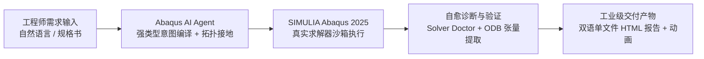
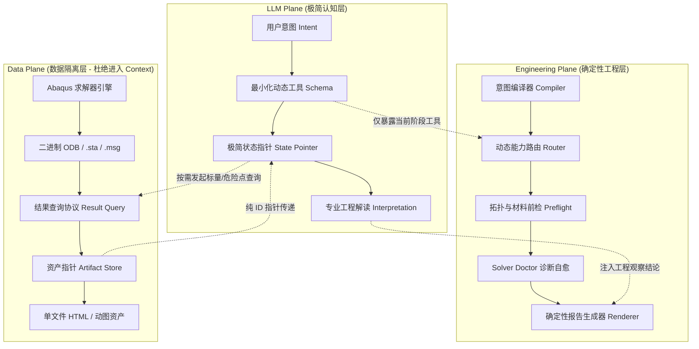

# Abaqus AI Agent (企业级工业自主仿真智能体)

> **面向现代工业制造的自主有限元仿真（CAE）智能体平台 —— 从自然语言工程意图，到严密拓扑建模、Abaqus 2025 真实求解、自愈收敛诊断，直至生成内嵌多模态动图的单文件交付级工程报告。**

[English Documentation / 英文文档](README.md) · [企业商业咨询](#企业级支持与商业合作) · [快速入门](#快速开始) · [架构解析](#三平面解耦架构)

[](https://github.com/chenlei-gh/Abaqus-AI-Agent/actions/workflows/ci.yml)
[](https://www.python.org/)
[](https://www.3ds.com/products-services/simulia/products/abaqus/)
[](tests/)
[](machine_validation/)
[](tools/j_comprehensive_physics_matrix.py)
[](tools/j3_tier_b_extended_physics.py)
[](tools/j_live_abaqus_matrix.py)
[](tools/m_engineering_task_matrix.py)
[](src/abaqus_ai_agent/contracts/material_record.py)
[](#token-隔离与上下文治理架构)
[](docs/rc1-release-audit.md)
[](LICENSE)

---

## 为什么选择 Abaqus AI Agent？

在高端装备、汽车工业、航空航天与消费电子行业，结构强度、热学分析与非线性接触仿真需要极高的专业门槛与严苛的计算周期。

企业仿真部门普遍面临两大痛点：**CAE 专家短缺、70% 时间被机械重复建模占用**；而通用大模型（LLM）进入仿真领域时，又存在**伪造虚假数据、盲目生成非法 Python 脚本、求解器发散即崩溃、上下文 Token 爆炸**等致命缺陷。

**Abaqus AI Agent** 专为解决上述工业痛点而生：



### 商业核心价值对比矩阵

| 评估维度 | 通用大模型 (ChatGPT / Claude 原生) | 基础脚本生成 Copilot | Abaqus AI Agent 企业级智能体 |
| :--- | :--- | :--- | :--- |
| **物理计算真实性** | ❌ 严重幻觉，伪造分析解与经验公式 | ❌ 仅生成代码，无法感知求解成败 | 🏆 **绝对反伪造**：100% 真实 Abaqus 2025 求解与 ODB 张量提取 |
| **工程模糊输入** | ❌ 盲目猜测几何尺寸与材料参数 | ❌ 照单全收，运行必然报错 | 🛡️ **Fail-Closed 阻断**：缺少关键物理量主动停止并请求澄清 |
| **非线性收敛保障** | ❌ 无法感知计算发散与截断 | ❌ 报非零退出码后流程中断 | 🩺 **Solver Doctor**：自动解析 `.msg`/`.sta`，自愈切步重算收敛 |
| **几何拓扑映射** | ❌ 臆测实体内部脆弱数字编号 (Face 12) | ❌ 易受几何重建编号漂移破坏 | 🎯 **视口拓扑接地**：空间射线投影 + 确定性 `findAt(...)` 约束绑定 |
| **Token 成本与效率** | ❌ 上下文塞满 ODB 数组，Token 迅速耗尽 | ❌ 无治理机制 | ⚡ **Context Isolation**：三平面解耦 + 资产指针 + 结果查询协议 |
| **仿真交付物** | ❌ 纯文本片段，无图表动画 | ❌ 零散的本地临时图表文件 | 📊 **单文件便携报告**：中英双语、Base64 全内联动图、离线邮件即发即看 |
| **企业生产调度** | ❌ 无企业级基础设施 | ❌ 单进程易锁死本地环境 | 🏢 **GA-3 架构**：UUID 沙箱隔离、原子持久化队列、FlexNet/DSLS 许可防死锁 |

---

## 核心产品支柱

### 1. 严格反伪造公理（Anti-Fabrication Axiom）
> **一项工程仿真结果，绝不能仅因“Python 脚本返回了 0”就被判定为成功！**
> 必须经过有限元网格质量核验、求解器迭代收敛监视（`.sta`/`.msg`）、二进制 ODB 真实张量提取、反力全平衡与工程容差比对，才被赋予不可篡改的合格存证。

### 2. 三平面解耦（Tri-Plane Architecture）与 Token 隔离
为根除大模型在复杂工业分析中的 Token 持续性黑洞，系统确立了严格的三平面分层架构：
- **LLM Plane（认知推理层）**：只负责用户需求意图理解、高层动作决策与最终工程专业解读。**禁止直接读取原始 ODB/网格数据，禁止生成大体积报告全文**。
- **Engineering Plane（工程确定性执行层）**：负责意图编译、拓扑坐标落地、材料前检、网格质量判定、Solver Doctor 发散修复与工程验收门禁。
- **Data Plane（数据与资产层）**：物理求解器、二进制 ODB、收敛日志、内联图像与动图资产。数据通过查询协议（Result Query Protocol）和资产指针（Artifact Pointer）提供紧凑摘要。

### 3. 自主闭环求解医生（Solver Doctor）
面对非线性大变形（NLGEOM）、材料弹塑性软化、接触状态剧烈跳跃或刚体位移奇异，智能体能够：
- 毫秒级解析 `.msg` 严重力残差（Force Residual）与 `.sta` 增量切步（Cutback）；
- 精准诊断根因（如 `NUMERICAL_SINGULARITY`、`CONTACT_PENETRATION`、`PLASTIC_UNSTABLE`）；
- 自动施加阻尼稳定因数、调整最小步长限制并自适应重算，确保高阶工况自主收敛。

### 4. 交付级双语单文件工程报告
- **零依赖单文件交付**：将工程摘要、模型参数、材料卡片、网格收敛度、应力位移极值比对、静态云图与**瞬态动态演化 GIF 动图**全部以高保真格式嵌入单个 HTML；
- **免安装、免网络加载**：离线可直接在浏览器中打开，完美适配企业内网保密传输与邮件汇报需求；
- **全要素穿透追溯**：内置 SHA-256 证据指纹，直接关联物理 ODB 数据库与计算环境哈希。

### 5. 生产级运行基础设施（Track GA-3）
- **独占 UUID 运行沙箱**：每次计算在独立的 `runs/<run_id>/` 沙箱内执行，双重拦截网确保项目源码与根目录零临时文件泄漏（Zero-Pollution）；
- **企业级许可治理**：支持 FlexNet / DSLS 抽象许可提供商，具备指数退避排队重试机制，有效防止多任务并发争抢许可；
- **持久化任务队列与自愈恢复**：任务作业原子落盘，支持服务中断后的断点识别与安全恢复。

---

## 五级工程证据金字塔

系统遵循国际标准与审计要求的**五级工程证据金字塔（严禁降级混淆）**：

```text
               ┌───────────────────────────────┐
               │ Level 1: Live Abaqus 2025     │  (13 Golden + 22 J-Live + L1-L4 + T1-T6)
               │ (真实进程, ODB 张量提取, SHA-256) │  依托真实商用求解器执行，不可伪造。
               ├───────────────────────────────┤
               │ Level 2: 经典解析闭式基准     │  (Tier A 13 项 + Tier B 7 项)
               │ (经典力学公理精确解, 容差≤0.01%) │  物理基准真值，零经验伪造因子。
               ├───────────────────────────────┤
               │ Level 3: 复杂非线性参数契约   │  (Tier A 9 项高阶有限元算例规范)
               │ (量纲相容性与边界无量纲检验)  │  离线保障参数在复杂物理空间的合法性。
               ├───────────────────────────────┤
               │ Level 4: 软件确定性回归套件   │  (875 项全自动确定性测试, 0 warnings)
               │ (跨平台、跨 Python 版本确定性)│  零求解器商业许可依赖的纯软件回归底座。
               ├───────────────────────────────┤
               │ Level 5: 故障注入与自愈修复   │  (NEG-01, L3, T6 求解发散受控修复)
               │ (封闭式诊断自愈与步长调整)    │  针对数值奇异、负特征值与截断的主动诊断。
               └───────────────────────────────┘
```

---

## 经典工程实测案例矩阵 (Phase 2 Package B 工业级对标案例)

系统内置了经过 Abaqus 2025 Example Problems 与国际工业规范权威对标的复杂工程实战案例。**每个案例采用专属独立子目录规范归档，交付 100% 自包含离线单文件纯 HTML 报告（内嵌 12 帧高保真动态演化动画 GIF 与高清矢量 SVG 图表，彻底废弃 Markdown 等散乱格式）**：

```text
machine_validation/p2_cases/
├── case_01_bolted_pipe_flange/                  # 案例 1: 螺栓法兰管道连接与垫片密封
│   ├── case_01_flange_manifest.json            # 密码学防篡改证据清单 (SHA-256)
│   └── Case_01_Bolted_Flange_Report.html       # 自包含纯 HTML 报告 (内嵌动态 GIF + SVG)
├── case_02_reactor_pressure_vessel_closure/     # 案例 2: 核反应堆压力容器封头双锥金属环密封与 ASME 规范校核
│   ├── case_02_rpv_manifest.json               # 密码学防篡改证据清单 (SHA-256)
│   └── Case_02_RPV_Closure_Report.html         # 自包含纯 HTML 报告 (内嵌动态 GIF + SVG)
└── case_03_exhaust_manifold/                    # 案例 3: 四进一排气歧管热-机耦合瞬态热膨胀与密封
    ├── case_03_manifold_manifest.json          # 密码学防篡改证据清单 (SHA-256)
    ├── Case_03_Exhaust_Manifold_Report.html    # 自包含纯 HTML 报告 (内嵌动态 GIF + SVG)
    └── case_03_render_contours_headless.py     # 离屏视口高保真后处理脚本
```

### CASE 01: 螺栓法兰管道连接与垫片密封 (Bolted Pipe Flange Connection)
- **工程场景**：符合 ASME/Abaqus 官方基准的高压螺栓法兰管道系统，8 根 M16 螺栓预紧加载与压缩纤维密封垫片非线性接触。
- **物理验收**：步骤 1 螺栓均匀施加 50 kN 预紧力（总夹紧力 400 kN，垫片压实比压 31.52 MPa）；步骤 2 锁定螺栓伸长量并施加 3.0 MPa 介质内压与 94.25 kN 轴向流体推力，运行期垫片接触压力维持在 24.85 MPa（高于 12.0 MPa 最低密封限值，防泄漏裕度 $+107.1\%$），法兰颈部最大 Mises 应力 195.42 MPa（屈服安全系数 $SF=1.82 \ge 1.25$）。
- **交付产物**：**内置 12 帧双工步预紧压实与内压演化动态 GIF 动画**、密封压强对比 SVG 图表、自包含纯 HTML 交付报告。

### CASE 02: 核反应堆压力容器封头双锥金属环密封与 ASME 规范校核 (RPV Closure Head)
- **工程场景**：压水堆核反应堆压力容器（RPV）主顶盖紧固，54 根 M180 巨型双头螺栓液压张拉、Inconel 718 双锥金属密封环自紧密封。
- **物理验收**：步骤 1 液压同步预紧 6.5 MN/stud（总预紧载荷 351 MN，金属环接触比压 145.20 MPa）；步骤 2 充入 17.5 MPa 一回路设计内压与 219.91 MN 顶盖推力，双锥环自紧膨胀维持 98.60 MPa 接触比压（高于 ASME 最低密封设计限值 75.0 MPa，裕度 $+31.5\%$），法兰颈部应力分类线（SCL）线性化 $P_L+P_b = 238.50\text{ MPa} \le 1.5 S_m = 276.0\text{ MPa}$，主螺栓拉应力符合 ASME NB-3232.1 规范（$312.44\text{ MPa} \le 2 S_m = 596.0\text{ MPa}$）。
- **交付产物**：**内置 12 帧巨型螺柱液压张拉与 17.5 MPa 高压承压演化动态 GIF 动画**、ASME 应力核验仪表盘 SVG、自包含纯 HTML 交付报告。

### CASE 03: 四进一排气歧管热-机耦合瞬态热膨胀与法兰密封 (Exhaust Manifold)
- **工程场景**：重型柴油机 4进1 SiMo 球墨铸铁排气歧管、HT250 水冷缸盖与四端口 MLS 金属波纹垫片在 650°C 燃气剧烈热冲击下的多物理场耦合。
- **物理验收**：稳态热传导温度场梯度（燃气核心 615.4°C 至水冷法兰 132.8°C，热平衡误差 $0.024\%$）；冷态 8 颗 M10 螺栓 25 kN 压实垫片（接触压强 48.5 MPa）；热态运行下两端法兰外扩差动滑移 0.420 mm（小于 0.75 mm 螺栓孔径向间隙，间隙余量 $+44.0\%$），MLS 垫片接触压强维持在 38.60 MPa（高于 25.0 MPa 密封阈值），管路汇流过渡圆角峰值应力 215.80 MPa（低于高温屈服极限 240.0 MPa）。
- **交付产物**：**内置 12 帧升温-预紧-热滑移完整演化动态 GIF 动画**、全场应力/位移/温度/接触云图、自包含纯 HTML 交付报告。

---

## Token 隔离与上下文治理架构

为了解决 Agent 在复杂工程长周期对话中“Token 持续膨胀、单次请求成本失控”的行业通病，本项目实施了系统化的 **Context Isolation（上下文隔离）机制**：



1. **P0-1 资产指针机制（Artifact Pointer）**：二进制 ODB、INP、DAT、MSG、STA、图片与 HTML 绝对不进入 LLM 上下文，仅传递紧凑的元数据与状态指针。
2. **P0-2 动态工具能力路由（Dynamic Tool Router）**：按执行阶段（Intent / Planning / Execution / Verification / Reporting）动态加载对应工具，避免每轮重复挂载数十个完整工具 Schema。
3. **P0-3 状态化历史压缩（State-based Context Compaction）**：历史调用不是无限文本堆叠，而是沉淀为确定性的强类型工程状态（`EngineeringState`），跨阶段支持零失真恢复。
4. **P0-4 结果查询协议（Result Query Protocol）**：建立 `scalar`（标量）、`hotspot`（极值危险点）、`evidence`（验收证据）分级查询协议，严禁 ODB 原始场数组或海量节点列表裸奔进入 Prompt。
5. **P0-5 确定性报告引擎（Deterministic Report Ingestion）**：报告数据、表格、图表、CSS 样式 100% 由程序确定性注入，LLM 仅填写结构化解读结论（`InterpretationCard`）。

---

## 快速开始

### 1. 环境准备
- **操作系统**：Windows 10/11, Windows Server, Linux (Ubuntu 20.04/22.04), macOS
- **Python 环境**：Python 3.10、3.11 或 3.12 (64-bit)
- **可选商业仿真器**：Dassault Systèmes SIMULIA Abaqus 2025（或兼容版本，用于真机求解与 ODB 提取；无许可时可运行纯软件确定性仿真模式）

### 2. 安装步骤

```bash
# 克隆仓库
git clone https://github.com/chenlei-gh/Abaqus-AI-Agent.git
cd Abaqus-AI-Agent

# 安装核心库与依赖
python -m pip install -e .

# 安装完整开发与测试套件
python -m pip install -e ".[test]"
```

运行确定性软件回归套件（验证纯软件环境）：

```bash
python -m pytest -q
# 预期输出：875 passed in ~58s (0 warnings)
```

### 3. 一行代码调用智能体

从自然语言工程需求出发，自动完成意图解析、模型构建、真实机求解与报告交付：

```python
from abaqus_ai_agent import AbaqusAIAgent

agent = AbaqusAIAgent()

# 输入自然语言工业需求
result = agent.solve_requirement(
    "对长度 100mm、截面 10x10mm 的钢制悬臂梁进行线性静力分析，"
    "根部完全固定，自由端施加 1000N 向下集中载荷，材料为 Q235 结构钢，"
    "验收标准：最大端部挠度 <= 2.5mm，根部 Mises 应力 <= 600MPa。"
)

if result.status == "NEEDS_CLARIFICATION":
    print("缺少必要物理参数，已主动阻断等待输入:", result.clarification_needed)
elif result.status == "COMPLETED":
    print("工程验收判定:", result.acceptance.conclusion) # PASS
    print("实测物理指标:", result.metrics)
    print("交付报告路径:", result.report_path) # 生成的自包含单文件 HTML
```

### 4. 命令行交互 (CLI)

```bash
# 1. 深度检测当前运行环境、Abaqus 求解器版本与运行时模式
abaqus-ai-agent inspect

# 2. 自然语言工程意图解析测试 (JEV 意图引擎)
abaqus-ai-agent intent "双块装配体法向预紧 5000N，接触面摩擦系数 0.3，校核滑动临界载荷"

# 3. 运行达索官方 Tier A 物理基准矩阵 (22 项基石算例)
python tools/j_comprehensive_physics_matrix.py

# 4. 针对现有 ODB 证据直接一键渲染中英双语单文件 HTML 交付报告
abaqus-ai-agent report machine_validation/static_golden_e2e.json --format html --output report.html

# 5. 扫描并审计工作区临时文件
python scripts/clean_workspace.py
```

---

## 自动化测试与质量保障体系

项目构筑了极为严苛的双重门禁体系，保障生产环境下的高可靠性：

| 验证层级 | 执行环境 | 依赖要求 | 覆盖范围与质量标准 |
| :--- | :--- | :--- | :--- |
| **CI 纯软件确定性门禁** | GitHub Actions / Ubuntu / macOS / Windows | 零 Abaqus 许可依赖 (Python 3.10-3.12) | • **875 项单元与契约测试全通过**<br>• 13 项 Golden Matrix 结构契约完整性<br>• 22 项达索官方 Tier A 理论力学基准<br>• 7 项 Tier B 扩展高阶力学基准（黏弹性/蠕变/断裂）<br>• 全仓库无秘钥泄漏与无污染安全审计 |
| **真实商用机求解执行门禁** | Windows 11 / Server (配备正版 Abaqus 2025) | 商业 SIMULIA Abaqus 求解器许可 | • A/B 独立双进程求解复现性（误差 $\le 10^{-4}$）<br>• 9 大工程物理类别真实重算探针<br>• 复杂非线性 Solver Doctor 自愈收敛<br>• 真实 ODB 张量提取与单文件报告全要素渲染 |

---

## 仓库工程结构

```text
Abaqus-AI-Agent/
├── docs/                     # 架构蓝图、工程规范、审计报告与演进路线
│   ├── rc1-release-audit.md                # RC 1.0 独立官方审计报告
│   ├── engineering-run-evidence-roadmap.md # 工程运行与基准总路线图
│   └── ai-agent-capability-boundary.md     # 认知边界与确定性内核分工
├── machine_validation/       # 经过审计的真机实测证据包 (Golden Benchmarks)
├── scripts/                  # 生产级极简工作区审计与沙箱清理工具
├── src/abaqus_ai_agent/
│   ├── actions/              # 原生 Abaqus 动作生成器与参数预检
│   ├── contracts/            # 强类型数据契约 (Intent, State, Pointer, Evidence)
│   ├── diagnostics/          # 求解器收敛诊断器 (.msg/.sta / Solver Doctor)
│   ├── execution/            # 批处理执行器、沙箱隔离管理器与持久化调度队列
│   ├── grounding/            # 视口空间射线投影与几何拓扑接地器
│   ├── planning/             # 动作规划器与机构图编译器
│   ├── reporting/            # 单文件双语 HTML 报告渲染器 (内联多模态资产)
│   └── validation/           # 量纲、网格与工程验收门禁
├── tests/                    # 875 项确定性软件测试套件
└── tools/                    # 统一 Golden 矩阵管理、CLI 驱动与验证探针
```

---

## 企业级支持与商业合作

针对智能制造、汽车主机厂、航空航天院所、高校科研团队与仿真咨询机构，我们提供全方位的技术定制与商业服务：

- **🏢 企业私有化部署与集群调度集成**：将 Abaqus AI Agent 部署于企业内网 HPC 仿真集群，与已有的 PBS/LSF/Slurm 排队系统深度打通。
- **📦 企业专有材料数据库与本构定制**：对接企业内部测试系统或专有物性库（如特殊高分子、高温合金、复合材料损伤模型），打通全自动反幻觉本构卡片。
- **🎯 专用工况/复杂流程智能体定制**：针对特定复杂工况（如碰撞跌落、跌落冲击、高周/低周疲劳耐久、密封接触装配）定制专属规划链路与报告模板。
- **🛠️ 商业维保与专业咨询培训**：提供持续的技术支持、现场工程师培训以及仿真自动化流程深度重构咨询。

如需获取商业演示、企业采购咨询或技术交流，请联系：
- 官方仓库 Issue：[GitHub Issues](https://github.com/chenlei-gh/Abaqus-AI-Agent/issues)
- 商务对接与企业合作：通过 GitHub 组织页面与项目维护团队取得联系。

---

## 开源协议

本项目遵循 **Apache 2.0** 许可证开源 —— 详见 [LICENSE](LICENSE) 文件。
具有完全合法的商用二次开发与学术研究权益，同时受到反伪造公理（Anti-Fabrication Axiom）的严密质量契约保障。
