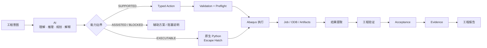
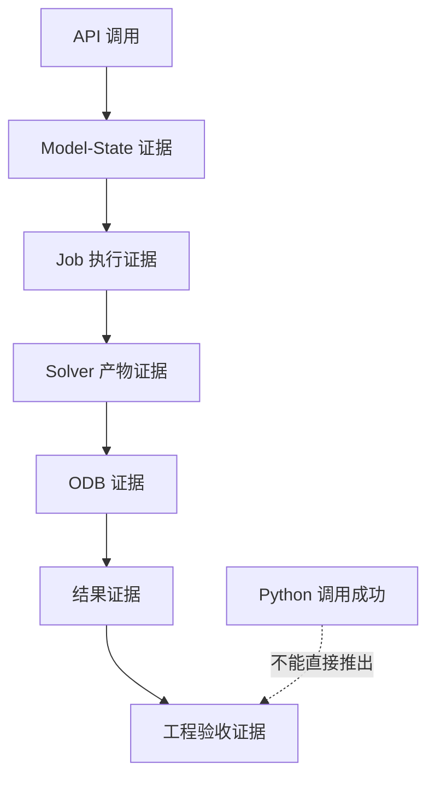
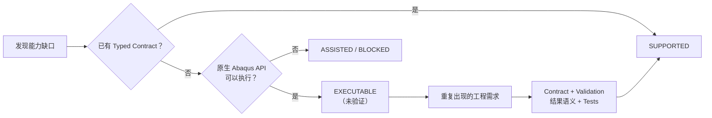

# Abaqus AI Agent

> **面向 Abaqus/CAE 的开源 AI 工程分析 Agent —— 从工程意图，到经过验证的原生 Abaqus 操作，再到求解证据、结果提取与工程验收。**

[English Documentation / 英文文档](README.md)

[](https://github.com/chenlei-gh/Abaqus-AI-Agent/actions/workflows/ci.yml)
[](LICENSE)

> **项目状态：** 架构与 Contract Closure 已基本收敛；Abaqus V5 R2018 / B28 真机验证作为独立的 Runtime Validation 阶段进行。

### 快速导航

- [项目概述](#项目概述)
- [项目能做什么](#项目能做什么)
- [工程闭环](#工程闭环)
- [架构](#架构)
- [设计原则](#设计原则)
- [安装](#安装)
- [最小使用示例](#最小使用示例)
- [当前能力状态](#当前能力状态)
- [测试与 CI](#测试与-ci)
- [Abaqus V5 R2018 / B28 验证](#abaqus-v5-r2018--b28-验证)
- [安全与失败边界](#安全与失败边界)
- [项目范围](#项目范围)
- [Roadmap](#roadmap)
- [仓库结构](#仓库结构)

---

## 一眼看懂



**这个边界是刻意设计的：** AI 可以理解和生成超出 Agent Typed Capability 的操作，但只有进入明确的执行与 Evidence 链路，才能成为 Agent 的正式工程能力。

### 工程证据阶梯



这条链路是项目避免“**代码跑通了，所以工程结果就是正确的**”这一常见 AI 工程陷阱的核心机制。

### 能力生命周期



这样项目可以持续扩展能力，同时避免因为 **LLM 能生成一段看起来可用的 Abaqus Python**，就虚增 Agent 的正式能力范围。

## 项目概述

**Abaqus AI Agent** 是一个面向 Abaqus/CAE 工程分析场景的 AI Agent。

它的目标不是替代 Abaqus 求解器，也不是把自然语言直接转换成未经验证的 CAD/有限元模型，而是把 AI 辅助工程分析过程连接成一条可验证的链路：

**工程需求 → 工程意图 → Solver 选择 → 几何/网格策略 → 经过验证的原生 Abaqus 操作 → Abaqus 执行 → ODB/结果提取 → 工程验证 → 工程验收 → Evidence → 工程报告**

项目刻意将 AI 层与 Abaqus 求解器解耦。

核心原则是：

> **一次 Abaqus Python 调用成功，并不等于工程分析成功。工程结论必须由模型状态、Job 产物、ODB 数据、结果提取以及明确的验收标准共同支撑。**

## 项目能做什么

项目主要围绕四类能力组织：**工程 Action、实时 Abaqus 执行、Geometry Grounding、工程可信度与 Evidence**。

### 工程分析 Action

当前 Action 层覆盖：

- 材料：
  - 弹性
  - 密度
  - 塑性
  - 导热系数
  - 比热
  - 热膨胀
- Solid Section 与 Section Assignment
- 分析步：
  - Static
  - Explicit Dynamics
  - Implicit Dynamics
  - Frequency
  - Heat Transfer
  - Coupled Temperature-Displacement
- Step 核心控制：
  - time period
  - maximum increments
  - initial/minimum/maximum increment
  - time incrementation method
  - stabilization
  - solution technique / reform kernel（适用时）
- Amplitude：
  - Tabular
  - Smooth Step
  - Periodic
  - Equally Spaced
- 载荷：
  - Gravity
  - Pressure
  - Concentrated Force
  - Body Force
  - Body Heat Flux
  - Surface Heat Flux
- 预定义场：
  - Initial Temperature
  - Initial Stress
- 边界条件：
  - Fixed / Encastre
  - Displacement
  - Symmetry
  - Temperature
- 装配实例操作：
  - inspection
  - translation
  - rotation
  - linear pattern
- 网格意图：
  - seeding
  - mesh generation
  - element-type intent
- 接触/约束意图：
  - tie
  - contact
- Job 创建与提交
- INP 导出
- ODB Field CSV 导出
- 网格收敛评价，并明确质量与应力奇异性边界
- 基于几何特征与工程关键区域的 Geometry → Mesh 策略
- 原生 Abaqus Mesh Quality 验证
- 确定性的 Solver Selection
- 按分析类型生成 Post-Processing Profile，并将其转化为实际结果要求
- Contact Diagnostics 与显式工程期望
- Fatigue 后处理 Contract / Workflow：cycle counting、应力幅/范围、半/全循环、mean-stress correction、多轴/应力分量语义
- Sensitivity / Uncertainty Evidence Contract
- 针对已有 Abaqus 应力历史的疲劳后处理工作流
- Engineering Report：Markdown / HTML / 可选 PDF
- 数值验证、工程检查、网格质量/收敛、疲劳、显式 Contact Diagnostics 的结构化 Acceptance Gate

Action 层并不追求把 Abaqus 全部 API 重新封装一遍。Abaqus 本身拥有庞大且随版本变化的 Python API，因此项目同时提供受控的原生 Python 扩展入口。

### 实时 Abaqus 执行

执行层支持：

- `AbaqusExecutor` 抽象
- JSON/TCP Bridge 执行
- InProcessExecutor 测试执行
- 模型检查
- Job 提交与状态检查
- ODB 检查
- Viewport 捕获辅助能力
- 批量 `.inp` 执行
- `cae noGUI` 执行
- Abaqus Python 执行
- Session / Runtime capability 检查
- 有边界的求解器诊断
- Job 产物收集

原生 Python Escape Hatch 很重要：常用工程操作由类型化 Action 覆盖，而尚未封装的合法 Abaqus API 仍然可以被显式调用，不让 Action 层变成能力瓶颈。

### 几何 Grounding

项目把几何选择视为一个**证据问题**，而不是简单的名称或索引问题。

当前包括：

- 规范化 image/intent contract
- 实时 Abaqus Face/Edge descriptor
- Viewport camera/projection 提取
- 标定后的平行投影 screen grounding
- 候选评分与排序
- confirmation policy
- JSON-safe evidence serialization
- 只读 Viewport PNG 探针

核心安全规则：

> **图片中的标注并不能自动证明某一个 Abaqus Face/Edge 就是目标区域。**

例如，不能因为模型中存在 `Face[17]`，就把图片上的某个区域直接认定为 Face 17。目标区域必须来自 Viewport/Image 证据，或者由用户明确提供。

### Planning / Validation / Evidence

项目提供：

- experiment input contract
- engineering plan
- blocker 与 assumption 报告
- Action validation
- Preflight
- static-analysis planning
- model snapshot 与 state diff
- Job status classification
- ODB metadata normalization
- Field / History / Frame result extraction
- acceptance evaluation
- evidence packaging
- `AbaqusAIAgent` orchestration facade

## 工程闭环

当前完整工程闭环已经收敛为：

> **Intent → Outputs → Execution → Results → Verification → Acceptance → Evidence → Report**

```text
Engineering Intent
        ↓
Solver Selection
        ↓
Post-Processing Profile
        ↓
Effective Result Criteria
        ↓
Output Planning
        ↓
Native Abaqus Output Requests
        ↓
Job Execution
        ↓
Artifacts / ODB
        ↓
Result Extraction
        ↓
Verification
 ┌──────────────┬──────────────┬──────────────┐
 │ Numerical    │ Engineering  │ Mesh Quality │
 │ Verification │ Checks       │ / Convergence│
 ├──────────────┼──────────────┼──────────────┤
 │ Fatigue      │ Contact      │ Sensitivity /│
 │ Verification │ Diagnostics  │ Uncertainty  │
 └──────────────┴──────────────┴──────────────┘
        ↓
Acceptance
        ↓
Engineering Status
        ↓
Evidence
        ↓
Engineering Report
```

其中有一个重要规则：

> **没有提供某项验证，不自动等于失败；但一旦显式提供验证结果，其失败就不能被 Acceptance 静默绕过。**

项目最重要的设计目标之一，是把“工程验收”真正闭环：

```text
验收标准
   ↓
Result Requirements
   ↓
需要的 Abaqus 输出
   ↓
Job 执行
   ↓
Artifacts + ODB
   ↓
结果提取
   ↓
工程验收
   ↓
Evidence
```

因此项目不会把以下几件事混为一谈：

```text
"Python 调用成功"
        ≠
"Abaqus 模型正确"
        ≠
"Solver 成功完成"
        ≠
"需要的结果已经存在"
        ≠
"工程要求已经满足"
```

每一个阶段都必须有相应证据，并且 Contract 不能只停留在定义层：它必须进入实际的 Planning / Execution / Extraction / Verification / Acceptance / Report 链路。

---

## AI / Agent 能力边界

AI 与 Agent 在“能否理解/生成某项 Abaqus 操作”上允许重叠；真正的边界是**执行权限与工程证据**。

| 状态 | 含义 |
|---|---|
| `SUPPORTED` | 存在明确的 Typed Action、Validation 与 Execution 语义，可以宣称 Agent 支持。 |
| `EXECUTABLE` | 可以通过原生 Python Escape Hatch 执行，但 Agent 尚未完整拥有该操作的领域语义；执行不等于工程验证。 |
| `ASSISTED` | AI 可以规划/推理，但 Agent 没有可靠执行路径。 |
| `UNSUPPORTED` | 没有可靠的 Agent 执行路径。 |
| `BLOCKED` | 原则上存在路径，但缺少运行环境、输入或必要证据。 |

核心规则：

> **AI 能够生成或推理某项操作，并不意味着该操作已经成为 Agent 的正式工程能力。只有进入明确的执行、验证与 Evidence 边界，才能提升能力声明。**

因此，发现“AI 能做、当前 Typed Action 没有覆盖”的能力缺口时，不应该直接伪造一个已支持能力，而应按：

`SUPPORTED` → `EXECUTABLE`（原生 Python Escape Hatch）→ `ASSISTED` / `BLOCKED`

进行处理。

`python_action` 成功只能证明请求跨过了执行边界；不能单独证明模型正确、Solver 成功、目标 ODB 结果存在或工程验收通过。

详见 [AI / Agent 能力边界](docs/ai-agent-capability-boundary.md)。

## 架构

项目刻意采用 **Action + Evidence** 为核心的架构，而不是继续增加一个庞大的 Autonomous Orchestrator。

```text
用户 / 工程需求
       │
       ▼
EngineeringIntent
       │
       ▼
AnalysisWorkflow
       │
       ├────────────────┐
       ▼                ▼
ModelSnapshot      Viewport / Image
       │                │
       └───────┬────────┘
               ▼
        Geometry Grounding
               │
               ▼
        Validated Action
               │
               ▼
            Preflight
               │
               ▼
           Executor
               │
               ▼
            Abaqus
               │
          ┌────┴────┐
          ▼         ▼
         Job     Model State
          │
          ▼
  Artifacts / Diagnostics
          │
          ▼
         ODB
          │
          ▼
   Result Requirements
          │
          ▼
 Field / History / Frame
       Extraction
          │
          ▼
      Acceptance
          │
          ▼
        Evidence
```

### 架构边界

| 层 | 主要职责 |
|---|---|
| Contracts | 工程意图、模型状态、结果、Runtime、Evidence 的稳定数据结构 |
| Actions | 小粒度、明确的原生 Abaqus 操作 |
| Builders | 面向调用者构建 Action |
| Validation | 执行前的参数与语义检查 |
| Preflight | 针对当前模型/runtime 状态的前置检查 |
| Script Generation | Action → Abaqus Python |
| Execution | Bridge / InProcess / Batch 执行 |
| Inspection | Model / Session / Job / ODB 观察 |
| Results | 确定性的 Field / History / Frame 结果提取 |
| Acceptance | 针对工程要求进行验收 |
| Evidence | 记录执行了什么、观察到了什么、依据是什么 |

没有任何一个组件需要独自掌握完整工程流程。

---

## 设计原则

### 1. Native Abaqus First

尽可能直接使用 Abaqus 原生模型与分析接口。

项目不建立一个容易与 Abaqus 实际状态发生偏离的“第二套有限元模型”。

### 2. Explicit Actions

Action 必须小、明确、可检查。

一个 Action 应当能够被：

- 验证
- Preview
- 执行
- 与预期模型状态比较
- 关联 Evidence

### 3. Evidence Before Claims

必须区分：

- API invocation evidence
- Model-state evidence
- Job execution evidence
- Solver artifact evidence
- ODB evidence
- Result evidence
- Acceptance evidence

这些证据不能互相替代。

### 4. Geometry 必须 Ground

视觉输入必须通过明确的证据链映射到实际 Abaqus Region。

项目不会把名称、索引或集合顺序默认为稳定的视觉身份。

### 5. Verification 与 Solver Execution 必须分离

Job 完成首先只是执行事实，不自动等于工程有效。

工程有效性需要由结果提取、数值验证、工程检查、网格质量/收敛、疲劳验证以及在明确提供时的接触诊断共同支撑。

Sensitivity / Uncertainty 属于分析证据域，不作为所有问题的普遍 Pass/Fail Gate。

一旦某项验证结果被明确提供，其失败必须进入 Acceptance，不能静默降级。

### 6. 不伪造求解能力

不能因为存在一个 API 风格的类，就宣称一个工程能力已经完成。

例如当前 Fatigue 能力是：

**针对已有 Abaqus 应力历史进行后处理的 Contract / Workflow**

而不是已经实现完整数值疲劳求解器。

### 7. Release-aware Compatibility

Abaqus 自带 Python 运行时和原生 API 具有明显的版本依赖。

外部 Python 包目标为 Python 3.9+；生成给 Abaqus 执行的脚本则有意避免不必要的现代 Python 专属语法。

具体原生 API 是否兼容，必须在目标 Abaqus 版本上实际验证。

---

## 安装

外部 Python 包目标为 **Python 3.9+**。

克隆仓库：

```bash
git clone https://github.com/chenlei-gh/Abaqus-AI-Agent.git
cd Abaqus-AI-Agent
```

安装：

```bash
python -m pip install -e .
```

安装测试依赖：

```bash
python -m pip install -e ".[test]"
```

运行测试：

```bash
python -m pytest -q
```

普通测试不需要安装 Abaqus License。

---

## 最小使用示例

一个典型流程可以从一个明确的 Action 开始：

```python
from abaqus_ai_agent.actions import static_step
from abaqus_ai_agent.actions.runner import preview

action = static_step(
    "Model-1",
    time_period=1.0,
    max_num_inc=100,
)

print(preview(action))
```

生成的是明确的 Abaqus 原生操作，可以在进入实际执行边界之前进行验证。

对于暂时没有类型化 Builder 的合法 Abaqus API：

```python
from abaqus_ai_agent.actions import python_action

action = python_action(
    "Model-1",
    "print(list(mdb.models.keys()))",
)
```

这个 Escape Hatch 是有意保留的：Action 层不应该成为合法 Abaqus API 的人工瓶颈。

---

## 当前能力状态

| 能力 | 状态 |
|---|---|
| Core Action Contracts | 已实现 |
| Materials / Sections | 已实现 |
| Static Analysis | 已实现 |
| Explicit Dynamics | 已实现 |
| Implicit Dynamics | 已实现 |
| Heat Transfer | 已实现 |
| Coupled Temperature-Displacement | 已实现 |
| Amplitudes | 已实现 |
| Gravity | 已实现 |
| Reference Points / 刚体约束 (Rigid Body) | 已实现 |
| 刚体动力学（RP + RigidBody 物理摆） | Abaqus 2025 Golden E2E 验证已通过；多刚体 Connector / Joint 族待验证 |
| Initial Temperature / Stress | 已实现 |
| Assembly Instance Operations | 已实现 |
| INP Export | 已实现 |
| ODB CSV Export | 已实现 |
| Result Extraction | 已实现 |
| Solver Selection | 已实现 |
| Post-Processing Profile | 已实现 |
| Geometry → Mesh Strategy | 已实现：Contract / Planning 层；B28 真机执行验证待完成 |
| Native Mesh Quality Verification | 已实现：Action / Script 层；B28 真机验证待完成 |
| Mesh Convergence | 已实现 |
| Engineering Acceptance Gates | 已实现 |
| Contact Diagnostics | Contract + Acceptance 集成已实现 |
| Fatigue Verification | Contract / Workflow + Acceptance 集成已实现 |
| Sensitivity / Uncertainty | Evidence / Report 集成已实现 |
| Engineering Report | 已实现 |
| Geometry Grounding | 已实现：当前针对标定 Viewport / Projection 路径 |
| Fatigue | 已实现：已有应力历史的 Contract / Workflow，并覆盖循环计数、应力范围/幅值、均值应力修正及多分量语义边界 |
| Arbitrary Native Abaqus API | EXECUTABLE：Python Escape Hatch；不等同于工程验证 |
| 任意外部照片的全自动几何注册 | 当前不宣称 |
| 完整独立 Fatigue Solver | 未实现 |
| CAD / Part / Sketch / Extrude 自动建模 | 当前有意延后 |
| Tosca / Topology Optimization 自动化 | 当前有意延后 |

---

## 测试与 CI

GitHub Actions 在以下情况下运行 Python 测试：

- push 到 `main`
- push 到 `feature/**`
- Pull Request

CI 使用 Python 3.11，并执行：

```bash
python -m pip install -e ".[test]"
python -m pytest -q
```

普通 CI 不依赖 Abaqus License，因此与真实 Abaqus 运行环境相关的测试会独立进行。

---

## Abaqus 2025 真机验证

项目已经在一台真实授权的 Abaqus 2025 Windows 运行环境完成 Smoke 全链路验证。

已实际验证：

1. `cae noGUI` 启动与 CAE License；
2. 参数化模型创建；
3. 网格生成；
4. `writeInput`；
5. Abaqus/Standard Job 提交与求解完成；
6. Solver 产物检查；
7. ODB 打开；
8. `U` / `RF` 必要场输出检查。

本次运行实际生成并读取了 ODB，Solver 产物也明确报告分析成功。Harness 不会把单独的 process exit code 当作成功依据；当进程内 `Job.status` 不可用时，可以使用 `.sta` / `.log` Solver 产物作为完成证据。

因此当前可以正式记录：

**Abaqus 2025 Machine Validation: PASS**

这不等同于 R2018 / B28 兼容性验证。

### Abaqus 2025 真机 Golden 验证阶梯

下列工程 Golden Case 均已在 Abaqus 2025 Windows 真机环境完成实际求解与证据闭环：

| 验证案例 | 物理基准与核心关注点 | 判定与验收标准 | 状态 |
|---|---|---|---|
| **Smoke Test** | B28/2025 执行闭环基础通道 | CAE 启动 + Solver Artifacts + ODB 可读性 | ✅ PASS |
| **P0-1 Static Golden** | 3D 悬臂梁自由端受集中力弯曲 | 解析挠度对比、反力平衡、根部应力合理性 | ✅ PASS |
| **P0-2 Mesh Convergence** | 三档网格划分 (Coarse / Medium / Fine) | 真实 ODB 位移、Richardson 外推、GCI、加严门禁真实 FAIL | ✅ PASS |
| **P1 Tie Contact** | 双块装配体界面运动学连续 | 25 对接口节点相对位移为 0、反力平衡 | ✅ PASS |
| **P1 Implicit Dynamic** | 斜坡载荷瞬态动力学悬臂梁 | 多时间帧动态响应、动能/内能比、动载荷放大系数 | ✅ PASS |
| **P1 Steady Thermal** | 3D 杆体一维稳态热传导 | 解析温度分布、热流守恒、加严门禁真实 FAIL | ✅ PASS |
| **P1 General Contact** | 块体压紧与库仑摩擦滑移 | 法向接触压力、切向摩擦力 (μ=0.25 误差 0.08%)、接触诊断 | ✅ PASS |
| **刚体动力学 Golden** | 铰接刚体物理摆大角度重力摆动 ($L=600\text{ mm}, \theta_0=10^\circ$) | 振动周期 ($T_{\text{corr}}=1.2713\text{ s}$, 误差 0.08%)、最大角速度 (误差 0.27%)、机械能守恒 | ✅ PASS |

> **刚体动力学与多体动力学边界说明**：当前刚体动力学 Golden E2E（MBD-1）完成验证的是基于 Reference Point 与原生 `RigidBody` 约束的重力驱动单刚体动力学基准。真正的多体动力学（包含体间连接器如 `CONN3D2`、Revolute/Cartesian/Slot 铰接单元族以及多连杆机构）从 MBD-2 开始规划与验证，目前尚未纳入真机 Golden E2E 闭环，不提前宣称支持。

## Abaqus V5 R2018 / B28 验证

项目不会仅根据“API 名称看起来一致”就宣布某个 Abaqus 版本兼容。

针对 **Abaqus V5 R2018 / B28**，推荐的真实机验证链路是：

1. Generated Script Smoke Test；
2. Model 创建/检查；
3. `writeInput` 验证；
4. 最小 Solver Job；
5. Job Artifact 检查；
6. ODB 打开；
7. Result Extraction；
8. CSV / Evidence 生成；
9. Failure Classification。

只有相关流程真正跑过 B28，才能把对应能力标记为 **verified**。

特别需要强调：

> **一个 Python 进程正常退出，或者返回 exit code 0，都不能单独证明 CNEXT、目标 Abaqus 命令、Solver Job 或预期 ODB 结果成功。**

---

## 安全与失败边界

项目有意拒绝以下不安全假设：

- 未 Ground 的图片坐标不能直接成为可执行 Region；
- Abaqus Python 正常返回不能直接作为 Solver 成功证据；
- Job 完成不能自动等同于工程验收；
- ODB 存在不能自动证明目标结果正确；
- 局部网格加密本身不能证明网格已经收敛；
- 疑似应力奇异点附近的峰值不能自动当作物理收敛峰值；
- Sensitivity / Uncertainty 不自动成为普遍的工程 Pass/Fail 标准；
- API 参数看起来兼容不能自动证明 Release 兼容；
- Model-specific contact、mesh 以及 release-specific API 在无法泛化验证时必须保持显式。

这些边界属于架构的一部分，而不是可有可无的文档说明。

---

## 项目范围

### 当前范围

- Abaqus/CAE 上的 AI 辅助工程分析
- Model inspection 与状态 Grounding
- Native Abaqus Actions
- Validation / Preflight
- Job execution 与 diagnostics
- ODB / Result Extraction
- Acceptance / Evidence
- 通过 Native Abaqus Python 进行受控扩展

### 当前核心明确不做

- 替代 Abaqus Solver
- 为每一个 Abaqus API 都制作类型化 Wrapper
- 从图片直接进行无限制 Autonomous Geometry Mutation
- 没有数值方法实现却宣称完整 Fatigue Solver
- 把 CAD 建模作为本项目的主要目标
- 用 Topology Optimization 取代明确的工程需求

---

## Roadmap

近期工程路线：

1. 保持 Action / Validation / Execution / Verification / Evidence 链路稳定；
2. 完成剩余的全仓 Contract Closure Audit；
3. 完成 B28 Smoke-Test Harness；
4. 在真实 Abaqus R2018/B28 环境运行；
5. 对真实 Release-specific incompatibility 进行分类与修复；
6. 只有真实工程流程证明需要时，才继续扩展能力。

后续可能扩展：

- 更强的 Geometry Grounding
- 更多 Result Extraction 模式
- 更广的 Native Abaqus Action 覆盖
- 更强的 Job Diagnostics
- 更完整的 Fatigue Post-processing
- 更多 Release-specific Adapter

所有新增能力都应保持：

**Action → Validation → Execution → Evidence**

这一基本边界。

---

## 参考项目与生态

实时执行边界参考了公开的 Abaqus 自动化/MCP 项目，包括：

- [Abaqus-Control-MCP](https://github.com/forxyo/abaqus-control-mcp)
- [CAE-Agent-Hub](https://github.com/chenlei-gh/CAE-Agent-Hub)

这些项目展示了 Live Abaqus Bridge、任意 Python 执行、Model Inspection、Job Monitoring、ODB Inspection、Viewport Interaction 等有价值的工程模式。

本项目吸收“Live Abaqus Execution Boundary”这一思路，同时进一步强调：

- Explicit Geometry Grounding
- Validation
- Result Requirements
- Acceptance
- Evidence

而不是重新实现 Abaqus 本身。

---

## 仓库结构

```text
Abaqus-AI-Agent/
├── src/
│   └── abaqus_ai_agent/
│       ├── actions/          # 明确的 Abaqus 操作与脚本生成
│       ├── adapters/         # Live Abaqus / Model Adapter
│       ├── contracts/        # 工程、模型、结果、Runtime Contract
│       ├── execution/        # Executor、Job、Artifact、Batch
│       ├── validation/       # Validation 与 Preflight
│       └── workflow/         # Analysis Workflow
├── tests/                    # Unit / Contract Tests
├── .github/workflows/        # CI
├── pyproject.toml
├── LICENSE
├── README.md                 # English Documentation
└── README_CN.md              # 中文文档
```

---

## 贡献

欢迎符合工程边界的贡献。

一个高质量贡献通常应该包含：

- 清晰的能力或缺陷描述；
- 明确的 Validation 行为；
- 针对确定性逻辑的 Tests；
- 必要的 Release-specific 假设；
- Live Abaqus 行为对应的 Evidence 要求；
- 不对尚未验证的 Solver 或工程正确性做过度声明。

对于 Release-specific Abaqus API，建议明确记录实际测试过的 Abaqus 版本。

---

## License

Apache-2.0。

仓库原始许可证保持不变。第三方集成、文档和依赖应继续遵守各自的署名与许可证要求。

---

**文档：** [中文](README_CN.md) · [English](README.md)
