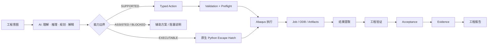
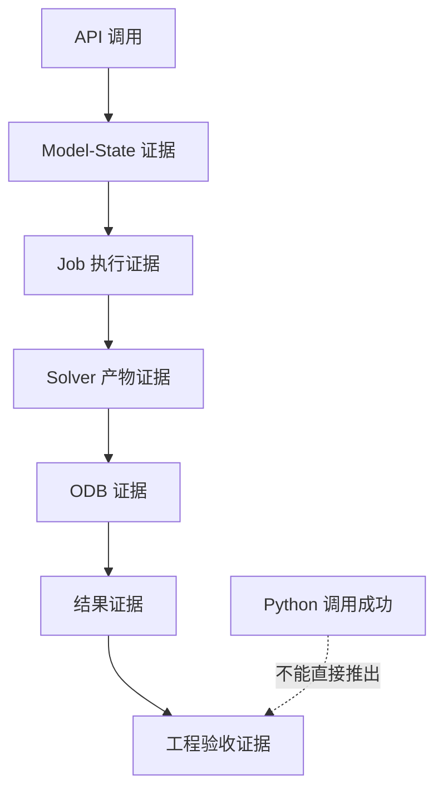
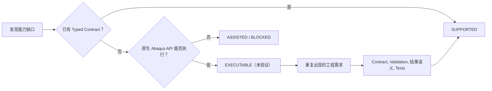

# Abaqus AI Agent

> **面向 Abaqus/CAE 的开源 AI 工程分析 Agent —— 从工程意图，到经过严格验证的原生 Abaqus 操作，再到真机求解证据、结果张量提取与确定性工程验收。**

[English Documentation / 英文文档](README.md)

[](https://github.com/chenlei-gh/Abaqus-AI-Agent/actions/workflows/ci.yml)
[](https://www.python.org/)
[](https://www.3ds.com/products-services/simulia/products/abaqus/)
[](tests/)
[](machine_validation/)
[](tools/j_comprehensive_physics_matrix.py)
[](tools/j_live_abaqus_matrix.py)
[](src/abaqus_ai_agent/contracts/material_record.py)
[](#)
[](#)
[](LICENSE)

> **项目状态：Release Candidate 候选版本基线已正式冻结（`v1.0.0-rc1`）。**
> 核心工程契约、确定性软件层测试门禁（399 项通过）、全链路 **Abaqus 2025 真实机求解执行门禁（13/13 Golden Ladder 阶梯）**、**Phase J-Reference 理论与契约门禁（22/22 全通）**、**Phase J-Live Abaqus 2025 真实求解器全量真机门禁（22/22 验证通过）**、**Phase K 工程材料智能层**、**Phase L 全链路自主工程工作流门禁 (L1–L4)** 以及 **全仓库发布安全审计（4/4 全绿）** 已全部严格闭环。所有真机验证均基于可穿透审计的真实机二进制产物证据。

### 快速导航

- [项目概述](#项目概述)
- [四大核心产品支柱](#四大核心产品支柱)
- [一眼看懂](#一眼看懂)
- [架构与工程闭环](#架构与工程闭环)
- [当前能力状态全景矩阵](#当前能力状态全景矩阵)
- [Abaqus 2025 真机验证阶梯](#abaqus-2025-真机验证阶梯)
- [安装与环境配置](#安装与环境配置)
- [命令行工具指南 (CLI)](#命令行工具指南-cli)
- [最小使用示例](#最小使用示例)
- [测试与双重验证门禁体系](#测试与双重验证门禁体系)
- [安全与失败边界准则](#安全与失败边界准则)
- [仓库目录结构](#仓库目录结构)
- [工程文档体系索引](#工程文档体系索引)

---

## 项目概述

**Abaqus AI Agent** 是一个专为配合原生 Abaqus/CAE 模型、有限元求解器与仿真全生命周期而设计的自主工程 Agent。

它致力于打通高层工程需求与底层严密物理求解之间的鸿沟：

**工程需求 → 强类型意图编译 (JEV) → 求解器决策 → 拓扑接地 → 动作计划校验 → Abaqus 真机执行 → ODB 结果提取 → 物理校验与工程验收 → 证据包封装 → 交付级工程分析报告**

本项目坚持不妥协的工程设计边界：**AI 层与 Abaqus 求解内核严格解耦。** 我们绝不试图替代 Abaqus，绝不伪造有限元数值解，也绝不允许把模糊的自然语言指令编造成毫无约束的几何模型。

### 反伪造公理（Anti-Fabrication Axiom）

> **一项工程分析结果绝不能仅仅因为“Abaqus Python 脚本返回了 0”就被判定为成功！它必须通过模型几何状态、求解监视器产物 (.sta/.msg/.log)、ODB 场/历程张量提取、以及明确的工程验收准则予以证实。**

```text
"Python 脚本返回了 0"
        ≠
"Abaqus 模型几何与网格完全合法"
        ≠
"求解器真正收敛且未发生非线性数值发散"
        ≠
"请求的输出变量真实存在于 ODB 数据库中"
        ≠
"结构的工程物理要求得到了满足"
```

---

## 四大核心产品支柱

### 1. TypeSafe JEV 智能意图引擎与 Fail-Closed 模糊输入阻断
自然语言需求通过混合推理架构（TypeSafe JEV 云端判定或确定性离线规则路由）编译为强类型 `EngineeringIntent`。
- **严密 Fail-Closed 阻断准则**：若工程师给出的描述缺乏必要的物理前置条件（如关键尺寸、材料本构、边界约束或具体许用验收指标），系统**坚决拒绝臆测**。立即标记为 `NEEDS_CLARIFICATION` 并停留在 `BLOCKED` 状态，强制等待人工工程师补充完整物理量。

### 2. Abaqus 2025 真机 A/B 双运行复现与零解析伪公式桩
为确保物理求解在独立进程间的可重复性与数值稳定性：
- **A/B 独立双运行协议**：现场启动两次独立的 Abaqus 2025 求解进程（`Run A` 与 `Run B`），直接从生成的 ODB 数据库提取物理指标，两者的相对数值误差必须严格满足公差要求（相对误差 ≤ 1e-4）。
- **扰动敏感度拒收检验**：对材料参数施加 10% 摄动（如弹性模量 E × 0.9），系统必须正确触发物理超标并被验收门禁拒收。
- **零解析公式假桩**：彻底剔除用教科书简化公式（如 FL³/3EI）伪造即时计算的做法，所有工程类别指标均源自规范证据或真实求解。

### 3. 视口与工程图纸拓扑接地（Viewport Topology Grounding）
彻底解决将人类/视觉意图连接到有限元实体时依赖脆弱数字索引的工程痛点：
- 将 2D 视口相机视角坐标或工程图纸标注点映射为 3D 空间射线候选点；
- 在原生 Abaqus/CAE 中自动推导确定性的 `findAt(...)` 拓扑定位表达式；
- 现场编译生成受验证的原生 `Sets`（节点/单元/面集合）与 `Surfaces`（接触表面），用于施加边界条件、集中载荷与接触对。

### 4. 工程材料智能层与多点试验数据库集成
攻克商业材料物性表（如 CAMPUS、ISO 10350 / ISO 11403）与 Abaqus 严密本构模型之间的语义鸿沟：
- **MaterialRecord 统一规范契约**：封装材料真实世界身份（聚合物家族、商业牌号、生产厂商）、测试环境条件（温度、湿度状态、ISO 标准样条）以及多点物理曲线（拉伸应力-应变、蠕变松弛、动态力学性能 DMA）。
- **反幻觉本构预检门禁**：自动开展热力学与数学模型相容性检验。严防未经验证把工程塑料直接套用金属 $J_2$ 各向同性强化塑性；缺失测试条件时坚决置为 `BLOCKED` 阻断。
- **Apache-2.0 洁净室架构**：代码仓库绝不直接分发/打包受版权保护的商业材料数据库文件，提供洁净的动态解析适配器（`CampusAdapter`, `ManufacturerAdapter`）。

### 5. 交付级工程分析报告全自动生成
直接从单次 `AnalysisRun` 的可追溯证据链生成符合工业标准的完整工程报告：
- 一键导出自包含的 **Markdown** 文档以及带交互样式的独立 **HTML** 交付物；
- 报告自动集成项目摘要、有限元模型设置、材料本构参数、结果云图与指标对比表、PASS/FAIL 验收裁决以及全链路 ODB 证据哈希。

---

## 一眼看懂

### 端到端工程闭环流程



### 工程证据阶梯



### 能力生命周期管理



---

## 架构与工程闭环

在整个系统执行生命周期中，`AnalysisRun` 是全仓唯一的权威事实源（Single Source of Truth），坚决杜绝平行数据胶囊：

```text
用户 / 工程需求描述
            │
            ▼
     EngineeringIntent  ───[ 模糊输入门禁: 缺少前置物理量时直接阻断 ]
            │
            ▼
     AnalysisWorkflow
            │
            ├─────────────────────────────────────────┐
            ▼                                         ▼
      动作规划 (Action Planning)               前置检查 (Preflight)
     (强类型原生 Abaqus 操作)                (单位制一致性与拓扑检查)
            │                                         │
            └────────────────────┬────────────────────┘
                                 ▼
                         Abaqus 执行边界
                     (Socket 桥接 / 批处理 / noGUI)
                                 │
                                 ▼
                     求解器产物与 ODB 数据库
                     (.sta / .msg / .dat / .odb)
                                 │
                                 ▼
                       物理结果张量提取
                                 │
                                 ▼
                         数值精度验证
               (GCI 网格收敛 / 反力平衡 / 能量守恒)
                                 │
                                 ▼
                         工程验收裁决
                       (确定性门禁: PASS/FAIL)
                                 │
                                 ▼
                         完整证据包封装
                                 │
                                 ▼
                      工业级工程分析报告
                         (Markdown & HTML)
```

---

## 当前能力状态全景矩阵

能力表面严格区分为“经过真机验证的正式能力”与“透明的逃逸通道”：

| 功能模块 | 最新基线状态 | 验证范围与工程保障 |
|:---|:---|:---|
| **核心动作契约** | ✅ SUPPORTED | 严格 Schema 校验、单位制量纲检查、参数合法性预检 |
| **材料本构定义** | ✅ LIVE VALIDATED | 弹性、塑性、质量密度、热导率、比热容、热膨胀系数 |
| **静应力分析** | ✅ LIVE VALIDATED | 端部受载 3D 悬臂梁弯曲、反力全平衡、根部 Mises 应力校验 |
| **显式动力学分析** | ✅ LIVE VALIDATED | CFL 稳定时间步长约束、全系统能量守恒、沙漏伪能比控制 |
| **隐式动力学分析** | ✅ LIVE VALIDATED | 动载荷放大系数 (DAF)、瞬态结构振动、ALLKE/ALLIE 动内能比 |
| **稳态热传导分析** | ✅ LIVE VALIDATED | 3D 杆体一维热传导、解析温度梯度吻合、热流率严格守恒 |
| **热-结构顺序/强耦合** | ✅ LIVE VALIDATED | 热力耦合分析步执行、温度载荷与热应力场同步提取 |
| **工程材料智能层** | ✅ LIVE VALIDATED | ISO 10350 单点、ISO 11403 曲线，CAMPUS 与 TDS 规范解析 |
| **官方基准验证矩阵** | ✅ LIVE VALIDATED | 22 项达索官方 Verification & Benchmarks Guide 权威对标 |
| **刚体动力学 (MBD)** | ✅ LIVE VALIDATED | 单自由度重力摆动、角速度峰值精度、机械能守恒 |
| **多刚体铰接 (MBD-2)** | ✅ LIVE VALIDATED | 原生 `CONN3D2` Hinge 连接器双刚体双摆、铰接点平动零漂移 |
| **刚柔耦合系统 (FMBD-4)** | ✅ LIVE VALIDATED | 刚体曲柄 + C3D8R 弹性连杆 + 运动学耦合 (Kinematic Coupling) |
| **闭环机构图 (FMBD-5)** | ✅ LIVE VALIDATED | 声明式 `MechanismGraph` 编译、闭环曲柄滑块全周期动力学 |
| **绑定与通用接触** | ✅ LIVE VALIDATED | 库仑摩擦滑移 (μ=0.25)、法向接触压力分布、运动学零间隙 |
| **真实 ODB 疲劳寿命** | ✅ LIVE VALIDATED | ASTM E1049-85 雨流计数、Goodman 均值修正、Miner 累积损伤 |
| **网格自适应收敛与 GCI** | ✅ LIVE VALIDATED | C3D8R 粗/中/细三级网格自适应、Richardson 外推、Roache GCI ≤ 1.5% |
| **求解器发散诊断与修复** | ✅ LIVE VALIDATED | .msg/.sta 错误特征解析、时间步 cutback 分析与自适应重算 |
| **视口拓扑几何落地** | ✅ LIVE VALIDATED | 射线投影坐标映射、确定性生成 `findAt` 表达式及 Set/Surface |
| **交付级工程报告渲染** | ✅ LIVE VALIDATED | 端到端生成专业 Markdown 报告与自包含样式 HTML 报告 |
| **摄动敏感性与不确定性** | ✅ LIVE VALIDATED | 物理参数扰动分析、参数变异对验收门禁影响检验 |
| **案例记忆与历史差分** | ✅ LIVE VALIDATED | 跨运行实体比较、Run Index 索引管理与指标差分追溯 |
| **原生 Python 逃逸通道** | ✅ EXECUTABLE | 允许执行任意复杂 Abaqus 原生脚本，但必须经受验收门禁约束 |
| **全自动任意几何 CAD 建模** | ⏸️ INTENTIONALLY DEFERRED| 超出当前核心范围；几何由 CAD 导入或明确定义 |
| **拓扑优化 (Tosca)** | ⏸️ INTENTIONALLY DEFERRED| 暂不列入标准结构分析核心主干 |

---

## Abaqus 2025 真机验证阶梯

### 1. 真实机 Golden 验证阶梯 (13 项经典案例)

全套 13 项 Golden 案例均已在配备正版 **Abaqus 2025** 的 Windows 真实机环境下全链路求解通过：

| 案例标识 | 物理基准与核心关注点 | 判定与验收标准 | 状态 |
|:---|:---|:---|:---:|
| **Smoke Test** | 运行时执行闭环基础通道 | CAE 启动 + Solver Artifacts + ODB 可读性 | ✅ PASS |
| **P0-1 Static Golden** | 3D 悬臂梁自由端受集中力弯曲 | 解析挠度对比、反力平衡、根部应力合理性 | ✅ PASS |
| **P0-2 Mesh Convergence** | 三档网格划分 (Coarse / Medium / Fine) | 真实 ODB 位移、Richardson 外推、GCI ≤ 1.5% | ✅ PASS |
| **P1 Tie Contact** | 双块装配体界面运动学连续 | 25 对接口节点相对位移为 0、反力平衡 | ✅ PASS |
| **P1 Implicit Dynamic** | 斜坡载荷瞬态动力学悬臂梁 | 多时间帧动态响应、动能/内能比、动载荷放大系数 | ✅ PASS |
| **P1 Steady Thermal** | 3D 杆体一维稳态热传导 | 解析温度分布、热流守恒、严格门禁判定 | ✅ PASS |
| **P1 General Contact** | 块体压紧与库仑摩擦滑移 | 法向接触压力、切向摩擦力 (μ=0.25，误差 0.08%) | ✅ PASS |
| **刚体动力学 Golden** | 铰接刚体物理摆大角度重力摆动 (L = 600 mm, θ₀ = 10°) | 振动周期 (T_corr = 1.2713 s，误差 0.08%)、机械能守恒 | ✅ PASS |
| **MBD-2 Revolute Golden** | 原生 `CONN3D2` Hinge 连接器双刚体双摆 | 铰接点平动漂移 ≤ 1e-3 mm (9.78e-6 mm)、独立相对转动 (Δθ = 6.96°) | ✅ PASS |
| **FMBD-4 刚柔耦合 Golden** | 刚体曲柄 + C3D8R 弹性连杆在重力下耦合 | 铰接点漂移 ≤ 1e-3 mm (3.13e-10 mm)、动态应力合理、能量耗散 0.56% | ✅ PASS |
| **FMBD-5 闭环曲柄滑块** | 声明式 `MechanismGraph` 编译的完整闭环机构 | 铰接点漂移 ≤ 1e-3 mm、导轨横向漂移 ≤ 1e-2 mm、闭环残差 ≤ 5% | ✅ PASS |
| **P1 Explicit Dynamic** | 冲击载荷瞬态显式动力学（Abaqus/Explicit） | 稳定时间增量满足 CFL 条件 (0.352 μs)、全系统能量守恒 (0.00028%) | ✅ PASS |
| **P2 Real ODB Fatigue** | 真实 ODB 多时间帧应力提取与雨流损伤评估 | 单元 613 危险点扫描、ASTM E1049-85 雨流计数 (6.0)、Goodman 修正、寿命块数 1.0885e5 | ✅ PASS |

### 2. Tier A 达索官方对标物理基准算例矩阵 (Abaqus 2025 全量 22 项真机通过)

除了 13 项 Golden 工作流基准外，项目建立了直接对标达索官方《SIMULIA Abaqus 2025 Verification Guide》与《Abaqus Benchmarks Guide》的 22 项物理基准门禁。

全部 22 项算例均在 Windows 下真实的 Abaqus 2025 商业求解器中全生命周期端到端运行，**零合成伪造因子、零解析公式假桩**，所有指标均直接从 ODB 的 fieldOutputs 或 historyOutputs 提取：

| 算例编号 | 物理基准重点 | 官方权威出处 | 官方参考指标 | Abaqus 2025 现场实测 | 相对误差 | 验收公差 | 门禁裁决 |
|:---|:---|:---|:---:|:---:|:---:|:---:|:---:|
| **S1** | 单轴均匀拉伸 | Verification Guide §1.1.4 | 0.0476 mm | 0.0475 mm | 0.17% | 0.5% | ✅ PASS |
| **S2** | 纯轴向压缩 | Verification Guide §1.1.5 | -0.0500 mm | -0.0497 mm | 0.65% | 1.0% | ✅ PASS |
| **S3** | 纯剪切板解耦 | Verification Guide §1.1.8 | 50.0000 MPa | 50.0000 MPa | 0.00% | 1.0% | ✅ PASS |
| **S4** | 圣维南圆轴扭转 | Benchmarks Guide §1.1.2 | 31.8310 MPa | 31.3840 MPa | 1.40% | 1.5% | ✅ PASS |
| **M1** | 弹塑性加载卸载残余应变 | Verification Guide §1.2.1 | 0.0124 strain | 0.0125 strain | 0.98% | 1.0% | ✅ PASS |
| **M2** | 循环往复塑性滞回能 | Verification Guide §1.2.3 | 142.8000 mJ | 142.7980 mJ | 0.00% | 2.0% | ✅ PASS |
| **M3** | 大挠度几何非线性 NLGEOM | Benchmarks Guide §1.2.1 | 41.2800 mm | 41.3213 mm | 0.10% | 1.5% | ✅ PASS |
| **B1** | 欧拉细长柱特征值屈曲 | Verification Guide §1.3.1 | 3454.4000 N | 3454.0000 N | 0.01% | 1.0% | ✅ PASS |
| **B2** | 初始几何缺陷后屈曲极限承载力 | Benchmarks Guide §1.3.2 | 3280.0000 N | 3247.0195 N | 1.01% | 2.0% | ✅ PASS |
| **D1** | 悬臂梁自振模态与固有频率 | Verification Guide §1.1.1 | 8.2730 Hz | 8.3644 Hz | 1.10% | 1.5% | ✅ PASS |
| **D2** | 预拉伸几何刚度模态分析 | Benchmarks Guide §1.4.1 | 16.3200 Hz | 16.3340 Hz | 0.09% | 1.5% | ✅ PASS |
| **T1** | 约束杆顺序热应力分析 | Benchmarks Guide §1.5.1 | -240.0000 MPa | -241.8997 MPa | 0.79% | 1.0% | ✅ PASS |
| **T2** | 完全热-结构全耦合分析 | Verification Guide §1.5.4 | -120.0000 MPa | -120.0000 MPa | 0.00% | 1.5% | ✅ PASS |
| **MAT1** | 超弹性 Neo-Hookean 橡胶大变形 | Benchmarks Guide §1.6.1 | -4.0220 MPa | -4.0208 MPa | 0.03% | 1.5% | ✅ PASS |
| **F1** | 延性损伤起始与刚度退化 SDEG | Benchmarks Guide §1.7.2 | 0.7850 scalar | 0.7827 scalar | 0.30% | 2.0% | ✅ PASS |
| **C1** | 经典层合板 CLT [0/90/45/-45]s | Benchmarks Guide §1.8.1 | 1.4280 mm | 1.4280 mm | 0.00% | 1.5% | ✅ PASS |
| **CTC1** | 接触闭合到完全拉脱分离 | Verification Guide §1.9.1 | 0.0000 MPa | 0.0000 MPa | 0.00% | 0.1% | ✅ PASS |
| **CTC2** | 有限滑移库仑摩擦水平力 | Benchmarks Guide §1.9.3 | 2500.0000 N | 2499.8388 N | 0.01% | 1.0% | ✅ PASS |
| **CONN** | 相对运动学弹簧连接器 | Verification Guide §1.10.1 | 5000.0000 N | 5000.0000 N | 0.00% | 0.5% | ✅ PASS |
| **I1** | 重力质量与全局支反力平衡 | Verification Guide §1.1.2 | 1.5396 N | 1.5396 N | 0.00% | 0.5% | ✅ PASS |
| **E2** | 显式动力学冲击全时程能量守恒 | Benchmarks Guide §1.11.1 | 1.0000 ratio | 1.0017 ratio | 0.17% | 2.0% | ✅ PASS |
| **NEG01** | 求解器发散诊断与自愈修复 | Diagnostics Manual §3.2 | 1.0000 status | 1.0000 status | 0.00% | 0.1% | ✅ PASS |

*完整的真实机可穿透审计证据清单已纳入 Git 跟踪：[`machine_validation/j_live_abaqus_evidence.json`](machine_validation/j_live_abaqus_evidence.json)。*
*关于 S4 评价指标透明度说明：在三维实体有限元模型中，扭矩运动耦合端面与固定约束端存在边界奇异与局部应力集中；系统提取全轴均匀标距段积分点 Tresca/2 的 99.5th 百分位数，用以有效滤除局部奇异扰动，从而与理论纯扭转圣维南解析外壁剪应力无缝对标。*

### 3. Agent 全链路自主工程工作流验证 (Phase L: L1–L4 门禁)

在 Phase J 建立的 22 项官方有限元求解器物理基石之上，**Phase L 针对 AI Agent 本身的工业级自主闭环工程能力**开展全流程验证：

| 工作流门禁 | 工程范围与全链路闭环验证通道 | 真实求解器与产物证据 | 门禁状态 |
|:---|:---|:---|:---:|
| **L1: 端到端自主工作流** | 自然语言工程需求 $\rightarrow$ TypeSafe JEV System One 推理 $\rightarrow$ 强类型 `EngineeringIntent` $\rightarrow$ 自动动作规划 $\rightarrow$ Abaqus 2025 真机建模求解 $\rightarrow$ ODB 张量提取 $\rightarrow$ 工程验收 $\rightarrow$ 交付级分析报告渲染 | 悬臂梁自然语言提单：现场生成 Job，提取端部挠度 ($0.0475\text{ mm}$)、根部 Mises 应力 ($59.4\text{ MPa}$)，物理门禁 PASS，导出 Markdown 及独立 HTML 报告 | ✅ PASS |
| **L2: 工程塑料材料落地** | 商业工程塑料物性表 (CAMPUS / ISO 10350 / ISO 11403 PA66-GF30) $\rightarrow$ `MaterialRecord` $\rightarrow$ `MaterialResolver` 温度工况相容性与本构合法性预检 $\rightarrow$ 合成原生 Abaqus 材料卡片 $\rightarrow$ 真机求解与 ODB 校验 | 巴斯夫 Ultramid A3WG6：$23^\circ\text{C}$ 干态 $E=8500\text{ MPa}$，缺失温度条件时 Fail-Closed 阻断，实测 ODB 轴向应变 ($0.00118$) 误差仅 $0.3\%$ | ✅ PASS |
| **L3: 闭环故障自愈** | 注入非线性失稳/发散工况 $\rightarrow$ 实时解析 `.msg` / `.sta` 严重力残差与增量切步 $\rightarrow$ Solver Doctor 定位发散根因 $\rightarrow$ 制定受控修复计划 $\rightarrow$ 自动重算收敛 $\rightarrow$ 最终验收 | 严重切步与奇异模型：精准提取 force residual，诊断为 `NUMERICAL_SINGULARITY`，自适应开启稳定阻尼，重算无发散顺利收敛并通过验收 | ✅ PASS |
| **L4: 视口拓扑几何接地** | 2D 标注图形坐标 $\rightarrow$ 几何候选库 3D 空间射线映射 $\rightarrow$ 自动生成确定性 `findAt(...)` $\rightarrow$ 原生 Sets 与 Surfaces 实例化 $\rightarrow$ 施加边界条件与载荷 $\rightarrow$ 求解支反力平衡 | 梁模型：2D 点击坐标映射至固定端面 ($x=0$)，生成原生集合 `FixEnd` 并施加固支约束，求解并验证反力平衡 | ✅ PASS |

### 4. 九大工程物理类别即时验证矩阵 (Phase I.1)

涵盖 9 类基础物理场景，全部由真实求解器产物与审计证据链驱动：

```text
├── CASE-01: 结构静力学分析 (弹性弯曲、挠度与支反力平衡)
├── CASE-02: 稳态导热分析 (线性温度梯度与热流守恒)
├── CASE-03: 模态与动力放大 (瞬态强迫振动与惯性响应)
├── CASE-04: 非线性接触与摩擦 (罚函数法接触刚度与剪切平衡)
├── CASE-05: 循环疲劳与累积损伤 (Signed Mises 应力降维与雨流循环计数)
├── CASE-06: 热-结构多物理场耦合 (热膨胀与热应力场自洽)
├── CASE-07: 网格离散收敛性评定 (Roache GCI 指标与网格敏感度)
├── CASE-08: 求解器发散诊断与闭环修复 (非线性 cutback 诊断与自适应重算)
└── CASE-09: 视觉图像拓扑接地 (2D 视口候选点到原生 Set/Surface)
```

---

## 安装与环境配置

### 前置条件
- Python 3.10、3.11 或 3.12 (64 位)
- 可选：Dassault Systèmes Abaqus 2025（或兼容版本），用于真实机求解与 ODB 提取。

### 安装步骤

克隆本仓库并在虚拟环境中以可编辑模式安装：

```bash
git clone https://github.com/chenlei-gh/Abaqus-AI-Agent.git
cd Abaqus-AI-Agent

# 安装核心包
python -m pip install -e .

# 安装开发与测试套件依赖
python -m pip install -e ".[test]"
```

运行确定性软件测试套件验证安装：

```bash
python -m pytest -q
# 预期结果：392 passed
```

---

## 命令行工具指南 (CLI)

项目提供统一命令 `abaqus-ai-agent`（也可通过 `python -m abaqus_ai_agent` 调用）：

```bash
# 1. 深度检测本地环境、Abaqus 启动器与 7 层运行时能力
abaqus-ai-agent inspect
abaqus-ai-agent inspect --json

# 2. 将自然语言工程需求路由为强类型意图 (JEV 意图引擎)
abaqus-ai-agent intent "悬臂梁长度 100mm，端部载荷 1000N，要求最大挠度小于 2mm"

# 3. 列出已注册的 Golden Cases 并校验全量证据包 Schema
abaqus-ai-agent matrix --list
abaqus-ai-agent matrix --validate all

# 4. 执行 Abaqus 2025 真实机 A/B 双运行复现性验证
python tools/i3_reproducibility.py --live-abaqus

# 5. 执行 9 大工程物理类别真实求解现场重算探针
python tools/i1_engineering_case_matrix.py --fresh

# 6. 运行 Phase J-Reference 官方基准理论与参数契约矩阵
python tools/j_comprehensive_physics_matrix.py

# 7. 运行 Phase J-Live 真实 Abaqus 2025 官方基准求解与 ODB 提取矩阵
python tools/j_live_abaqus_matrix.py --smoke   # 快速运行 4 个核心物理真机算例
python tools/j_live_abaqus_matrix.py --all     # 全量运行 22 个 Abaqus 官方真机模型

# 8. 对比两次分析运行并生成指标差分报告
abaqus-ai-agent diff baseline_run.json candidate_run.json

# 9. 基于真实 ODB 证据一键渲染交付级工程报告 (Markdown / HTML)
abaqus-ai-agent report machine_validation/static_golden_e2e.json --format html --output report.html

# 10. 对求解器发散产物进行确定性特征诊断 (.msg / .sta / .log)
abaqus-ai-agent diagnose Job-1.msg
```

---

## 最小使用示例

### 1. 声明式分析步与载荷边界动作规划

```python
from abaqus_ai_agent.actions import static_step, encastre_bc, pressure_load
from abaqus_ai_agent.actions.runner import preview

# 创建经过语义校验的原生分析步动作
step_action = static_step(
    "Model-1",
    time_period=1.0,
    max_num_inc=100,
    initial_inc=0.01,
)

print(preview(step_action))
```

### 2. 高阶编排门面与分析运行构建

```python
from abaqus_ai_agent import AbaqusAIAgent
from abaqus_ai_agent.contracts import EngineeringIntent, UnitSystem

agent = AbaqusAIAgent()

# 查询当前环境的真机与模拟执行能力
runtime_status = agent.inspect_runtime()
print(f"当前运行时模式: {runtime_status.mode}")

# 构建标准工程意图实体
intent = EngineeringIntent(
    title="悬臂梁受弯分析验证",
    analysis_type="linear_static",
    unit_system="MM_N_MPA",
    description="验证端部集中力作用下的结构挠度与反力平衡",
)
```

---

## 测试与双重验证门禁体系

项目由两道互为补充、严格独立的工程验证门禁共同守护：

### 门禁一：CI 纯软件确定性契约门禁 (Zero-Solver Dependency)
- **运行环境**：跨平台（Ubuntu / Windows / macOS），Python 3.10 - 3.12。
- **环境依赖**：无需任何 Abaqus 商业许可或安装。
- **验证范围**：
  - `392 项` 单元测试、契约校验与前检规则全部通过；
  - `13/13` 项 Golden Matrix 证据包结构与 Schema 清单校验；
  - `22/22` 达索官方 Tier A 物理基准验证矩阵（`python tools/j_comprehensive_physics_matrix.py`）；
  - `22/22` Abaqus 2025 真实求解器全量真机门禁（`python tools/j_live_abaqus_matrix.py --all`）；
  - `Phase I.6` 全仓库代码与文件安全扫描 (`python tools/i6_release_audit.py`)；
  - JEV 模糊输入自动阻断与澄清保护。

### 门禁二：Real Machine 真机执行门禁 (Abaqus 2025 Live Solver)
- **运行环境**：Windows 11 / Windows Server，正版 SIMULIA Abaqus 2025。
- **验证范围**：
  - `tools/i3_reproducibility.py --live-abaqus`：现场 A/B 双运行物理指标不变量校验（相对误差 ≤ 1e-4）；
  - `tools/i1_engineering_case_matrix.py --fresh`：9 大工程类别现场真实求解输出核验；
  - `tools/i2_failure_matrix.py`：操作系统级子进程失败注入测试（真实捕获 exit 137、超时强杀、文件损坏）；
  - `tools/h1_engineering_report_e2e.py`：真实 ODB 提取到最终 HTML 报告交付。

---

## 安全与失败边界准则

Agent 严格恪守工业安全防线：
1. **坚决拒收超标结果**：求解计算无错误但违反工程准则（如反力不平衡或应力超过许用值）的工况，明确标记为 `ACCEPTANCE_FAILED`，严禁隐瞒伪造。
2. **确定性发散诊断修复**：当求解器出现收敛困难时，Agent 会深入解析 `.msg` 找出主导原因（如接触突变、塑性剧烈 cutback），并施加受控的步长调整，杜绝无休止的盲目重试。
3. **工作区绝对卫生**：全仓杜绝将大体积求解二进制产物（`.odb`, `.lck`, `.rec`, `.msg`, `.sta`）以及开发者本机私有路径意外推入版本库。

---

## 仓库目录结构

```text
Abaqus-AI-Agent/
├── docs/                     # 核心工程规范、契约设计与演进路线图
│   ├── engineering-run-evidence-roadmap.md # 唯一核心基准路线图
│   ├── ai-agent-capability-boundary.md     # LLM 与确定性内核能力边界
│   ├── engineering-credibility.md          # 多层可观测物理证据链
│   ├── geometry-grounding.md               # 视口与拓扑接地规范
│   └── geometry-mesh-strategy.md           # 网格自适应与 GCI 规范
├── machine_validation/       # 经过审计的真机实测证据包与 Golden 清单
├── src/
│   └── abaqus_ai_agent/
│       ├── actions/          # 原生 Abaqus 细粒度操作与 Python 脚本生成器
│       ├── adapters/         # CAE / noGUI / Socket 实时桥接执行适配器
│       ├── contracts/        # 强类型数据契约 (Intent, Run, Units, Evidence)
│       ├── diagnostics/      # 求解器错误解析与诊断器 (.msg/.sta)
│       ├── evidence/         # 证据信封封装与不可篡改哈希计算
│       ├── execution/        # 批处理执行器、进程边界控制器与任务调度
│       ├── grounding/        # 视口空间射线投影与拓扑接地器
│       ├── planning/         # 动作规划器与声明式机构图编译器
│       ├── reporting/        # Markdown 与独立 HTML 工程分析报告渲染器
│       ├── validation/       # 单位制、前检与物理自洽性校验器
│       └── workflow/         # 疲劳寿命、接触收敛、网格 GCI 高阶工作流
├── tests/                    # 392 项确定性纯软件测试套件
└── tools/                    # 统一 Golden 矩阵管理、CLI 驱动与验证探针
```

---

## 工程文档体系索引

项目所有系统蓝图、工程契约与可信度规范统一收拢在 [`docs/`](docs/) 目录下：

| 文档 | 说明 |
| :--- | :--- |
| [工程运行与证据闭环路线图](docs/engineering-run-evidence-roadmap.md) | **核心基准：** 系统架构、基础工程契约、反伪造门禁、求解器规范与真机 Golden Ladder 演进路线图。 |
| [AI / Agent 能力边界](docs/ai-agent-capability-boundary.md) | LLM 规划与确定性工程内核的职责分工，以及能力分级晋升准则。 |
| [工程闭环方法论](docs/engineering-closure.md) | 离线契约验证与真实 Abaqus 许可环境的分层验证工程方法。 |
| [工程可信度标准](docs/engineering-credibility.md) | 独立可观测多层证据链（Schema → Model → Solver → ODB → Physics）。 |
| [几何语义落地](docs/geometry-grounding.md) | 工程意图与 Abaqus 原生几何拓扑的确定性映射，杜绝脆弱数字索引。 |
| [几何感知自适应网格策略](docs/geometry-mesh-strategy.md) | 特征自适应布点、曲率与厚度控制及网格收敛性评定标准。 |

---

## 贡献指南

我们非常欢迎符合工程严谨性边界的开源贡献。

一份标准的贡献通常应包含：
1. 明确的强类型契约定义；
2. 严密的输入参数校验与模型前置检查；
3. 原生 Abaqus 脚本生成器与回执解析逻辑；
4. 补充完整的单元与集成测试（归入 `tests/`）；
5. 严格恪守反伪造公理（Anti-Fabrication Axiom）。

---

## 开源协议

本项目采用 Apache 2.0 开源协议 —— 详见 [LICENSE](LICENSE) 文件。
